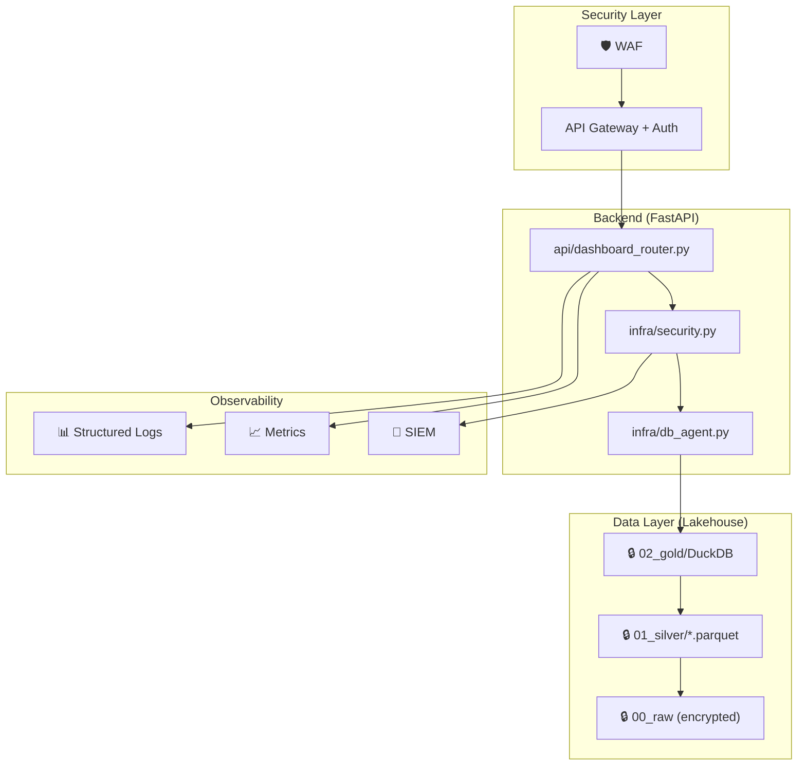

# Checklist de Backend Engineer  

**Funcionalidade:** Quantificação de alunos por média nas 5 disciplinas, com filtro por UF  
**Projeto:** ENEM Data Robotics v2  
**Responsável técnico:** _[preencher]_  
**Versão:** 3.0 – Revisado com Criptografia de Ponta, Cibersegurança, Escalabilidade e Estabilidade  
**Data de revisão:** 2025-12-11

---

## Sumário

1. [Arquitetura e Design de Domínio](#1-arquitetura-e-design-de-domínio)
2. [Contratos de API e Integração](#2-contratos-de-api-e-integração)
3. [Modelagem de Dados e Persistência](#3-modelagem-de-dados-e-persistência)
4. [Performance e Escalabilidade Avançada](#4-performance-e-escalabilidade-avançada)
5. [Confiabilidade, Resiliência e Estabilidade](#5-confiabilidade-resiliência-e-estabilidade)
6. [🔐 Criptografia e Proteção de Dados](#6-criptografia-e-proteção-de-dados)
7. [🛡️ Cibersegurança e Hardening](#7-cibersegurança-e-hardening)
8. [🔒 Segurança Zero-Trust e Compliance LGPD](#8-segurança-zero-trust-e-compliance-lgpd)
9. [Observabilidade, Logs e Alertas de Segurança](#9-observabilidade-logs-e-alertas-de-segurança)
10. [Testes de Backend e Segurança](#10-testes-de-backend-e-segurança)
11. [📊 Data Engineering Quality Gates](#11-data-engineering-quality-gates)
12. [CI/CD, Deploy e Migrações Seguras](#12-cicd-deploy-e-migrações-seguras)
13. [Qualidade de Código e Padrões](#13-qualidade-de-código-e-padrões)
14. [Backfill, Migração de Dados e Compatibilidade](#14-backfill-migração-de-dados-e-compatibilidade)
15. [Operação, Runbook e Incident Response](#15-operação-runbook-e-incident-response)
16. [🆘 Disaster Recovery e Business Continuity](#16-disaster-recovery-e-business-continuity)

---

## 1. Arquitetura e Design de Domínio

- [ ] A responsabilidade desta funcionalidade no backend está claramente delimitada  
  - Serviço/módulo específico (ex.: `analytics-enem-service`, `media-uf-module`), sem *god services*.  

- [ ] O fluxo ponta-a-ponta está desenhado e documentado  
  - Origem dos dados → processamento/agregação → persistência → exposição via API/consulta.  

- [ ] Não há acoplamento desnecessário com outras features  
  - Dependências explícitas, coesas e com fronteiras bem definidas.  

- [ ] Convenções de arquitetura do projeto foram respeitadas  
  - Padrão de camadas (controller/service/repository, hexagonal, clean architecture, etc.).  

- [ ] Decisões arquiteturais relevantes estão registradas (ADR ou similar)  
  - Ex.: onde ocorre o cálculo da média (batch vs on-demand), por que a agregação é feita offline, etc.

- [ ] Arquitetura Lakehouse (Medallion) respeitada  
  - Raw (00_raw) → Silver (01_silver) → Gold (02_gold)  
  - Dados imutáveis na camada Raw

- [ ] Princípios SOLID aplicados  
  - Single Responsibility, Open/Closed, Dependency Inversion

---

## 2. Contratos de API e Integração

> Preencher esta seção se a funcionalidade for exposta via API.

- [ ] APIs necessárias foram identificadas (REST/GraphQL/gRPC, etc.).  

- [ ] Contrato de requisição/resposta está claramente definido e versionado.  

- [ ] Nomes de campos são consistentes com o domínio ENEM  
  - Ex.: `ano_enem`, `uf`, `media_5_disc`, `faixa_media`, `qtd_alunos`.  

- [ ] O modelo de erro da API é consistente com o restante do backend  
  - Códigos HTTP, *error codes*, payload de erro.  

- [ ] Validações de entrada estão implementadas (Pydantic)  
  - UF válida, ano dentro de intervalo aceito, parâmetros obrigatórios, etc.

  ```python
  class MediaUfRequest(BaseModel):
      ano: int = Field(..., ge=1998, le=2024)
      uf: str | None = Field(None, pattern=r"^[A-Z]{2}$")
  ```

- [ ] Paginação/limites de consulta foram considerados (se aplicável)  
  - Para evitar respostas gigantes quando a granularidade for ampliada.  

- [ ] Rate limiting implementado  
  - 60 req/min por IP via SlowAPI ou similar

- [ ] Exemplos de uso da API estão documentados  
  - Requests e responses reais (incluindo casos com filtros diferentes).

- [ ] OpenAPI/Swagger gerado automaticamente  
  - Documentação acessível em `/docs` e `/redoc`

---

## 3. Modelagem de Dados e Persistência

- [ ] Tabelas/coleções necessárias foram definidas e revisadas  
  - Base (`fato_notas_enem`) e agregada (`agg_media5_por_uf`).  

- [ ] Tipos de dados são adequados  
  - `media_5_disc` como DECIMAL/FLOAT com precisão definida, `ano_enem` numérico, `uf` string curta, etc.  

- [ ] Índices foram pensados para os principais filtros  
  - Ex.: índice em (`ano_enem`, `uf`, `id_faixa`).  

- [ ] Migrações de schema estão descritas e versionadas  
  - Scripts de migração para adicionar colunas/tabelas, com rollback possível.  

- [ ] Estratégia de *backfill* está planejada  
  - Como popular `media_5_disc` e `agg_media5_por_uf` para anos anteriores.  

- [ ] Regras de integridade estão claras  
  - Relacionamento entre `agg_media5_por_uf` e `dim_faixa_media` (chaves, FKs se houver).

- [ ] Particionamento por `ano_enem` implementado para otimização  
  - Parquet particionado para reduzir I/O

- [ ] Schema evolution governance  
  - Processo para adicionar/modificar colunas sem quebrar consumidores

---

## 4. Performance e Escalabilidade Avançada

### 4.1 Metas de Performance (SLOs)

| Operação | P50 | P95 | P99 |
|----------|-----|-----|-----|
| GET `/v1/dados/media-uf` (cached) | < 50ms | < 100ms | < 200ms |
| GET `/v1/dados/media-uf` (uncached) | < 200ms | < 500ms | < 1s |
| Pipeline batch completo | - | - | < 5 min |

- [ ] SLOs documentados e acordados com stakeholders
- [ ] SLIs (indicators) implementados para medir SLOs

### 4.2 Otimizações de Query

- [ ] Foram estimados volume de dados e padrões de acesso  
  - Nº de registros por ano (~5M), nº de UFs (27), nº de faixas (4), consultas simultâneas.  

- [ ] As consultas de leitura estão otimizadas  
  - Projeção de campos apenas necessários, filtros bem indexados.  

- [ ] As rotinas de agregação não geram *full scans* caros sem necessidade  
  - Uso de partições (por ano), filtros progressivos, processamento incremental.  

- [ ] Pré-agregação em batch implementada (Parquet na Gold)  
  - Reduz queries em runtime em ~90%

- [ ] Query caching implementado com TTL apropriado (5min)  
  ```python
  from functools import lru_cache
  CACHE_TTL = timedelta(minutes=5)
  ```

### 4.3 Escalabilidade Horizontal

- [ ] Connection pooling configurado para DuckDB  
  - Reuso de conexões `read_only=True`

- [ ] Resource limits via PRAGMAs  
  ```sql
  SET memory_limit='2GB';
  SET threads=4;
  ```

- [ ] API é stateless (horizontally scalable)  
  - Sem estado em memória entre requests

- [ ] Sharding strategy definida para volumes muito grandes  
  - Ex.: sharding por região ou ano

- [ ] Auto-scaling policies documentadas (se aplicável)  
  - CPU/Memory thresholds para scale up/down

- [ ] Capacity planning realizado  
  - Projeções de crescimento de dados e usuários

### 4.4 Processos Batch

- [ ] Processos em batch têm janelas de execução viáveis  
  - Não competem com outras janelas críticas de processamento.

- [ ] Processamento incremental implementado  
  - Apenas novos dados são processados quando possível

---

## 5. Confiabilidade, Resiliência e Estabilidade

### 5.1 Tratamento de Erros

- [ ] Falhas em dependências externas (banco, outro serviço) são tratadas de forma previsível  
  - *Retries* com *backoff* exponencial; *timeouts* configurados.  

- [ ] Erros são categorizados corretamente  
  - Erros de cliente (4xx) x erros de servidor (5xx).  

- [ ] Operações críticas são atômicas ou idempotentes quando necessário  
  - Ex.: reprocessamento de dados agregados não gera duplicidade.  

### 5.2 Padrões de Resiliência

- [ ] **Circuit Breaker** implementado para dependências externas  
  ```python
  from circuitbreaker import circuit
  @circuit(failure_threshold=5, recovery_timeout=60)
  def call_external_service():
      ...
  ```

- [ ] **Bulkhead Pattern** para isolamento de falhas  
  - Pools de conexão separados para diferentes serviços

- [ ] **Graceful Degradation** implementado  
  - API retorna dados em cache quando backend falha

- [ ] Timeouts configurados em todas as operações de I/O  
  - Default: 30s para queries, 5s para health checks

### 5.3 Estratégias de Fallback

- [ ] Existe estratégia clara para *partial failures*  
  - O que acontece se uma parte do batch falha? marca, loga, reprocessa?  

- [ ] Cenários de indisponibilidade parcial foram pensados  
  - API continua servindo dados antigos se a carga diária ainda não rodou.

- [ ] Fallback para dados cached em caso de falha do banco

### 5.4 Health Checks

- [ ] **Liveness probe** implementado  
  - `/health/live` - container está rodando

- [ ] **Readiness probe** implementado  
  - `/health/ready` - serviço pode receber tráfego

- [ ] **Startup probe** implementado (se aplicável)  
  - Para serviços com inicialização lenta

### 5.5 Chaos Engineering

- [ ] Experimentos de caos planejados  
  - Simular falha de banco, latência alta, rede intermitente

- [ ] Runbooks para cenários de falha identificados

---

## 6. 🔐 Criptografia e Proteção de Dados

### 6.1 Criptografia em Repouso

- [ ] Arquivos Parquet criptografados com AES-256-GCM  
  - Usar PyArrow encryption features se disponível

- [ ] DuckDB database com encryption at rest  
  ```python
  conn = duckdb.connect('enem.duckdb', config={'encryption': 'aes256'})
  ```

- [ ] Chaves de criptografia gerenciadas centralmente (KMS)  
  - Nunca hardcoded no código

- [ ] **Envelope Encryption** para dados multi-tenant (se aplicável)  
  - Data Encryption Key (DEK) + Key Encryption Key (KEK)

### 6.2 Criptografia em Trânsito

- [ ] TLS 1.3 obrigatório para todas as comunicações  
  - TLS 1.2 como fallback mínimo

- [ ] Certificados SSL válidos e não auto-assinados em produção  

- [ ] HSTS (HTTP Strict Transport Security) headers configurados  
  ```python
  @app.middleware("http")
  async def add_security_headers(request, call_next):
      response = await call_next(request)
      response.headers["Strict-Transport-Security"] = "max-age=31536000; includeSubDomains"
      return response
  ```

- [ ] Perfect Forward Secrecy (PFS) habilitado

### 6.3 Gestão de Chaves

- [ ] **Key rotation** automática configurada  
  - Rotação mínima: 90 dias

- [ ] Chaves separadas para ambientes (dev/staging/prod)

- [ ] Backup seguro de chaves com teste de restore

- [ ] Audit trail de acesso às chaves

### 6.4 Hashing Seguro

- [ ] Senhas hasheadas com Argon2id ou bcrypt  
  ```python
  from argon2 import PasswordHasher
  ph = PasswordHasher()
  hash = ph.hash(password)
  ```

- [ ] Dados sensíveis mascarados/pseudonimizados em logs

- [ ] Tokens assinados com algoritmos seguros (RS256, ES256)

---

## 7. 🛡️ Cibersegurança e Hardening

### 7.1 OWASP Top 10 Checklist

- [ ] **A01:2021 - Broken Access Control**  
  - RBAC implementado, principle of least privilege

- [ ] **A02:2021 - Cryptographic Failures**  
  - Uso de algoritmos atuais (AES-256, SHA-256+)

- [ ] **A03:2021 - Injection**  
  - Queries parametrizadas em todo o código
  ```python
  # ❌ NUNCA
  sql = f"SELECT * FROM agg WHERE uf = '{uf}'"
  
  # ✅ SEMPRE
  sql = "SELECT * FROM agg WHERE uf = ?"
  agent.run_query(sql, params=[uf])
  ```

- [ ] **A04:2021 - Insecure Design**  
  - Threat modeling realizado

- [ ] **A05:2021 - Security Misconfiguration**  
  - Headers de segurança, desabilitar debug em prod

- [ ] **A06:2021 - Vulnerable Components**  
  - Dependency scanning ativo

- [ ] **A07:2021 - Identification Failures**  
  - MFA disponível, session management seguro

- [ ] **A08:2021 - Software/Data Integrity Failures**  
  - Assinatura de artefatos, verificação de integridade

- [ ] **A09:2021 - Security Logging Failures**  
  - Logs de segurança adequados

- [ ] **A10:2021 - SSRF**  
  - Validação de URLs externas

### 7.2 Análise Estática de Segurança (SAST)

- [ ] **Bandit** configurado para Python  
  ```bash
  poetry run bandit -r src/ -ll
  ```

- [ ] **Semgrep** com regras de segurança  

- [ ] Scan integrado no CI pipeline  
  - Build falha se vulnerabilidades críticas

### 7.3 Análise de Dependências

- [ ] **Dependabot** ou **Renovate** configurado  
  - Updates automáticos de segurança

- [ ] **pip-audit** ou **safety** no CI  
  ```bash
  poetry run pip-audit
  ```

- [ ] **Snyk** para scan profundo (opcional)

- [ ] SBOMs (Software Bill of Materials) gerados

### 7.4 Secrets Management

- [ ] Secrets gerenciados via Vault, SOPS ou similar  
  - Nunca em repositório Git

- [ ] `.env` files no `.gitignore`

- [ ] Secrets rotacionados periodicamente

- [ ] Detecção de secrets em commits (pre-commit hooks)  
  ```yaml
  # .pre-commit-config.yaml
  - repo: https://github.com/Yelp/detect-secrets
    hooks:
      - id: detect-secrets
  ```

### 7.5 Hardening de Runtime

- [ ] Container rodando como non-root user  
  ```dockerfile
  USER 1000:1000
  ```

- [ ] Read-only filesystem onde possível

- [ ] Resource limits definidos (CPU, memory)

- [ ] Network policies restritivas

- [ ] Seccomp/AppArmor profiles (se aplicável)

---

## 8. 🔒 Segurança Zero-Trust e Compliance LGPD

### 8.1 Autenticação e Autorização Zero-Trust

- [ ] JWT Bearer tokens obrigatórios  
  - Validação de assinatura, expiração, issuer

- [ ] **mTLS (Mutual TLS)** para comunicação entre serviços  
  - Certificados de cliente e servidor

- [ ] **RBAC (Role-Based Access Control)** implementado  
  ```python
  @require_role(["analyst", "admin"])
  async def get_media_por_uf(...):
      ...
  ```

- [ ] **Least Privilege Access**  
  - Usuários/serviços têm apenas permissões necessárias

- [ ] Session management seguro  
  - Tokens com curta duração, refresh tokens seguros

### 8.2 Network Security

- [ ] **Network Segmentation**  
  - API pública separada de serviços internos

- [ ] **API Gateway** como único ponto de entrada  
  - WAF (Web Application Firewall) configurado

- [ ] IP allowlisting para serviços internos (se aplicável)

- [ ] VPN/Private network para acessos admin

### 8.3 Compliance LGPD

- [ ] **Classificação de dados** implementada  
  | Nível | Descrição | Exemplo |
  |-------|-----------|---------|
  | PII | Dados pessoais identificáveis | CPF, nome |
  | SENSITIVE | Dados sensíveis de alunos | Notas individuais |
  | AGGREGATED | Dados agregados | Contagem por UF/faixa |

- [ ] Dados sensíveis em nível de aluno nunca expostos via API  
  - API retorna apenas agregados por UF/faixa

- [ ] Controles de permissão para dados granularizados estão definidos  

- [ ] **Right to Erasure** implementado  
  - Processo para remover dados de indivíduos específicos

- [ ] **Data minimization**  
  - Coletar/expor apenas dados necessários

- [ ] **Anonymization techniques** aplicadas  
  - k-anonymity, differential privacy onde aplicável

- [ ] **Consent management** (se aplicável)  
  - Registro de consentimento do usuário

- [ ] Políticas de retenção de dados documentadas e respeitadas

### 8.4 Auditoria e Rastreabilidade

- [ ] **Audit trail imutável** para operações críticas  
  - Quem acessou, quando, quais dados

- [ ] Logs não expõem dados sensíveis ou identificadores pessoais

- [ ] Logs de auditoria retidos por período adequado (ex.: 2 anos)

---

## 9. Observabilidade, Logs e Alertas de Segurança

### 9.1 Logging Estruturado

- [ ] Logs em formato JSON para integração com SIEM/ELK  
  ```python
  logger.info(
      "media_uf_pipeline_completed",
      extra={
          "run_id": run_id,
          "ano": 2023,
          "total_alunos": 4500000,
          "duration_seconds": 180
      }
  )
  ```

- [ ] Pontos de log foram definidos nos lugares certos  
  - Início/fim de jobs, volumes processados, parâmetros de entrada, erros.  

- [ ] Logs seguem o padrão do restante da stack  
  - Estruturados (JSON), com *correlation IDs*.  

- [ ] **Log levels** adequados  
  - DEBUG, INFO, WARNING, ERROR, CRITICAL

### 9.2 Métricas e Monitoring

- [ ] Métricas expostas (Prometheus-ready)  

  | Categoria | Métrica | Tipo |
  |-----------|---------|------|
  | Pipeline | `alunos_processados_total` | Counter |
  | Pipeline | `alunos_descartados_total` | Counter |
  | Pipeline | `pipeline_duration_seconds` | Histogram |
  | API | `http_requests_total` | Counter |
  | API | `http_request_duration_seconds` | Histogram |
  | Cache | `cache_hit_ratio` | Gauge |
  | Security | `auth_failures_total` | Counter |

- [ ] Dashboards de observabilidade criados (Grafana ou similar)

### 9.3 Security Logging (SIEM)

- [ ] **Logs de segurança** enviados para SIEM  
  - Autenticação, autorização, acessos negados

- [ ] **Anomaly detection** configurado  
  - Padrões de acesso incomuns, volume atípico

- [ ] Logs de auditoria incluem:
  ```python
  {
      "event": "data_access",
      "user_id": user.id,
      "resource": "/v1/dados/media-uf",
      "action": "read",
      "timestamp": "2025-12-11T10:30:00Z",
      "ip_address": request.client.host,
      "user_agent": request.headers.get("user-agent")
  }
  ```

### 9.4 Distributed Tracing

- [ ] **OpenTelemetry** instrumentado  
  - Tracing de requests ponta-a-ponta

- [ ] **Correlation IDs** propagados entre serviços  
  - `X-Request-ID` header

### 9.5 Alertas

- [ ] Alertas configurados para condições críticas

  | Condição | Severidade | Ação |
  |----------|------------|------|
  | Latência P95 > 1s | Warning | Investigar query |
  | Error rate > 5% | Critical | Verificar logs e rollback |
  | Pipeline > 10 min | Warning | Otimizar transformações |
  | Auth failures > 100/min | Critical | Investigar ataque |
  | Cache hit rate < 50% | Info | Revisar TTL |

- [ ] Alertas de segurança automáticos  
  - Failed logins, permission denials, unusual access patterns

---

## 10. Testes de Backend e Segurança

### 10.1 Pirâmide de Testes

```text
         🌐 E2E (Playwright)
       ────────────────────
        🔗 Integração (Pytest)
      ────────────────────────
       🧪 Unitários (Pytest)
     ──────────────────────────
      📐 Estático (Mypy/Ruff)
```

### 10.2 Testes Unitários

- [ ] Testes unitários cobrem a lógica de negócio principal  
  - Cálculo da média, classificação em faixas, filtros de UF/ano.  

- [ ] **Cobertura > 80%** em módulos críticos  

- [ ] Edge cases testados  
  - UF nula, notas nulas, faixas de borda, ausência de dados

  ```python
  @pytest.mark.parametrize("media,faixa_esperada", [
      (350.0, 1), (400.0, 2), (599.9, 2),
      (600.0, 3), (800.0, 4), (1000.0, 4)
  ])
  def test_classificacao_correta(media, faixa_esperada):
      assert classificar_faixa_media(media) == faixa_esperada
  ```

### 10.3 Testes de Integração

- [ ] Testes de integração cobrem:  
  - Interação com o banco (queries reais em ambiente de teste)
  - Fluxos de API ponta-a-ponta

- [ ] Testes de contrato de API (consumer-driven)

### 10.4 Testes de Performance

- [ ] Testes de carga/performance executados  
  - k6, Locust, ou similar

- [ ] Benchmarks de latência documentados

### 10.5 Testes de Segurança

- [ ] **SAST** integrado no CI (Bandit, Semgrep)

- [ ] **Dependency scanning** (pip-audit, safety)

- [ ] **DAST** (análise dinâmica) executado periodicamente  
  - OWASP ZAP, Burp Suite

- [ ] **Penetration testing** schedule definido (anual ou semestral)

- [ ] Testes de input validation  
  - SQL injection, XSS, path traversal

- [ ] Rate limiting testado  
  ```python
  async def test_rate_limiting(auth_client):
      for _ in range(70):  # limite é 60/min
          await auth_client.get("/v1/dados/media-uf", params={"ano": 2023})
      
      response = await auth_client.get("/v1/dados/media-uf", params={"ano": 2023})
      assert response.status_code == 429
  ```

---

## 11. 📊 Data Engineering Quality Gates

### 11.1 Data Contracts

- [ ] **Schema contract** definido entre produtor e consumidor  
  ```yaml
  # soda/contracts/agg_media5_por_uf.yml
  contract:
    producer: "pipeline-gold"
    consumer: "api-fastapi"
    sla: "dados atualizados até D+1"
  ```

- [ ] Breaking changes comunicados com antecedência

- [ ] Processo de aprovação para mudanças de schema

### 11.2 Data Quality Checks (Soda Core)

- [ ] Checks automatizados implementados  
  ```yaml
  checks for agg_media5_por_uf:
    - row_count > 0:
        name: "Tabela não está vazia"
    
    - missing_count(ano_enem) = 0:
        name: "Ano sem valores nulos"
    
    - missing_count(uf) = 0:
        name: "UF sem valores nulos"
    
    - values in (id_faixa) must be in [1, 2, 3, 4]:
        name: "Faixas válidas"
    
    - qtd_alunos > 0:
        name: "Quantidade de alunos positiva"
  ```

- [ ] Quality gates bloqueiam pipeline em caso de falha crítica

### 11.3 Data Quality SLOs

- [ ] SLOs de qualidade definidos  
  | Métrica | Target |
  |---------|--------|
  | Completude (campos obrigatórios) | 99.9% |
  | Freshness (dados atualizados) | < 24h |
  | Unicidade (sem duplicatas) | 100% |
  | Consistência (faixas válidas) | 100% |

### 11.4 Data Lineage

- [ ] **Linhagem de dados** documentada  
  - raw → silver → gold

- [ ] Metadados de versão capturados  
  - Versão do código, timestamp, parâmetros

- [ ] Ferramentas de lineage (OpenLineage, se aplicável)

### 11.5 Schema Evolution

- [ ] **Schema evolution governance** definida  
  - Processo para adicionar/remover campos

- [ ] Backward compatibility mantida  
  - Novas colunas são nullable ou têm default

- [ ] Deprecation policy documentada  
  - 30 dias de aviso para breaking changes

### 11.6 Volume Monitoring

- [ ] Volume de descarte monitorado e categorizado por motivo

- [ ] Alertas para volumes atípicos  
  - Muitos registros descartados, volume abaixo do esperado

---

## 12. CI/CD, Deploy e Migrações Seguras

### 12.1 Pipeline de CI

- [ ] Pipeline de CI valida:  
  - ✅ Build
  - ✅ Lint e formatação (Ruff, Black)
  - ✅ Type checking (Mypy)
  - ✅ Testes unitários e integração
  - ✅ Security scanning (SAST, dependency scan)
  - ✅ Code coverage gates (> 80%)

- [ ] Scan de secrets no código  
  - `detect-secrets`, `gitleaks`

### 12.2 Estratégia de Deploy

- [ ] Deploy é automatizado e segue o padrão da organização  
  - GitOps, pipelines declarativas

- [ ] **Estratégia de rollout** definida  
  - Dev → Staging → Production

- [ ] **Feature flags** ou **kill switches** considerados  
  - Possibilidade de desativar feature sem derrubar serviço

- [ ] **Canary/Blue-Green** deployment ready

### 12.3 Migrações de Banco

- [ ] Migrações de banco estão integradas ao processo de deploy  
  - Com *migrate up* e estratégia de rollback definida

- [ ] Ordem de deploy e migração planejada  
  - Compatibilidade entre versões

- [ ] Migrações testadas em staging antes de produção

### 12.4 Rollback Plan

- [ ] **Plano de rollback** documentado  
  - Como desativar a feature
  - Como reverter tabelas/dados
  - Tempo máximo para rollback (RTO)

- [ ] Rollback automatizado se health checks falharem

### 12.5 Artifact Security

- [ ] Imagens Docker assinadas e verificadas

- [ ] Only trusted registries

- [ ] Container image scanning (Trivy, Clair)

---

## 13. Qualidade de Código e Padrões

- [ ] Código segue o *style guide* da linguagem/framework usados  
  - Linters e formatadores automatizados (Black, Ruff).  

- [ ] **Pre-commit hooks** configurados  
  ```yaml
  # .pre-commit-config.yaml
  repos:
    - repo: https://github.com/psf/black
      hooks:
        - id: black
    - repo: https://github.com/charliermarsh/ruff-pre-commit
      hooks:
        - id: ruff
    - repo: https://github.com/pre-commit/mirrors-mypy
      hooks:
        - id: mypy
  ```

- [ ] Módulos são coesos e pouco acoplados  
  - Nada de arquivos gigantes com responsabilidades misturadas.  

- [ ] **Type hints** em todas as funções públicas

- [ ] Nomes de funções, classes e variáveis refletem o domínio ENEM/educacional.  

- [ ] **Docstrings** em módulos e funções principais

- [ ] Comentários explicam apenas o que não é óbvio pelo próprio código.  

- [ ] Revisões de código (PR reviews) focam em:  
  - Legibilidade, performance, segurança, aderência à arquitetura.

- [ ] Complexidade ciclomática monitorada

---

## 14. Backfill, Migração de Dados e Compatibilidade

- [ ] Estratégia de *backfill* de `media_5_disc` e `agg_media5_por_uf` está definida e testada.  

- [ ] Tempo estimado de backfill em produção foi avaliado.  

- [ ] Há plano para executar o backfill sem impactar operações normais  
  - Janelas de baixa carga, *throttling*, etc.  

- [ ] Relatórios/consumidores antigos foram verificados para garantir compatibilidade  
  - Campos renomeados, removidos ou adicionados não quebram nada crítico.

- [ ] Checksum/validação de integridade após backfill

---

## 15. Operação, Runbook e Incident Response

### 15.1 Runbook Operacional

- [ ] Existe um **runbook** documentando:  
  - Como rodar ou reprocessar a agregação manualmente
  - Como verificar se a última execução foi bem-sucedida
  - Como interpretar métricas e logs principais

- [ ] Erros comuns e suas ações corretivas estão documentados

### 15.2 Incident Response

- [ ] **Severity levels** definidos  
  | Nível | Descrição | Response Time |
  |-------|-----------|---------------|
  | P1 | Serviço indisponível | 15 min |
  | P2 | Degradação significativa | 30 min |
  | P3 | Impacto limitado | 4h |
  | P4 | Baixa prioridade | 24h |

- [ ] **Escalation matrix** definida  
  - Quem chamar em cada nível

- [ ] **Postmortem template** disponível

- [ ] Security incident response plan  
  - Passos para breach, data leak

### 15.3 Handover

- [ ] Time de operações/suporte foi avisado da nova funcionalidade

- [ ] Ponto de contato técnico responsável está definido  
  - Quem é a pessoa/time de referência para incidentes

- [ ] Documentação de onboarding para novos membros

---

## 16. 🆘 Disaster Recovery e Business Continuity

### 16.1 Backup Strategy

- [ ] **Backup policy** definida  
  | Dado | Frequência | Retenção |
  |------|------------|----------|
  | Gold layer | Diário | 30 dias |
  | Silver layer | Semanal | 90 dias |
  | Configurações | Por mudança | 1 ano |

- [ ] Backups criptografados

- [ ] Backups armazenados em localização separada  
  - Região diferente ou offsite

- [ ] **Restore tests** executados regularmente  
  - Mínimo: trimestral

### 16.2 Recovery Objectives

- [ ] **RPO (Recovery Point Objective)** definido  
  - Máxima perda de dados aceitável
  - Exemplo: 24 horas

- [ ] **RTO (Recovery Time Objective)** definido  
  - Tempo máximo para restaurar serviço
  - Exemplo: 4 horas

- [ ] Recovery procedures documentados e testados

### 16.3 High Availability

- [ ] **Single points of failure** identificados e mitigados

- [ ] Redundância implementada onde crítico  
  - Multiple AZs, replicas

- [ ] Failover automático testado (se aplicável)

### 16.4 Business Continuity

- [ ] **BCP (Business Continuity Plan)** documentado

- [ ] Comunicação durante outages definida  
  - Status page, canais de notificação

- [ ] Degraded mode operations planejadas  
  - O que fazer se componentes críticos falharem

---

## Anexo A: Referência Rápida de Comandos

```bash
# Backend
poetry run uvicorn enem_project.api.main:app --reload --port 8000
poetry run pytest tests/ -v --cov=enem_project

# Security Scans
poetry run bandit -r src/ -ll
poetry run pip-audit
poetry run ruff check src/

# Pipeline
poetry run enem etl-raw-to-silver --ano 2023
poetry run enem build-gold

# Data Quality
poetry run soda scan -d enem_gold soda/checks/agg_media5_por_uf.yml
```

---

## Anexo B: Diagrama de Arquitetura com Segurança



---

**Última atualização:** 2025-12-11  
**Versão:** 3.0  
**Autor:** Backend Engineer / Arquitetura ENEM Data Robotics v2
