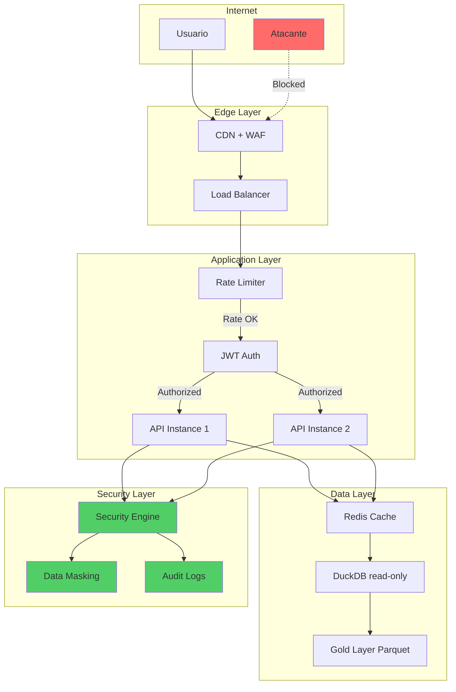

# Checklist de Staff Engineer: Deploy Seguro e Escalável

**Projeto:** ENEM Data Robotics V2  
**Versão:** 1.0  
**Data:** 2025-12-13  
**Responsável:** Staff Engineer  
**Foco:** Escalabilidade, Cibersegurança, Criptografia, Estabilidade em Produção

---

## Sumário Executivo

Este checklist estabelece os requisitos técnicos para deploy em produção, garantindo:
- **Zero Trust Architecture** em todas as camadas
- **Defesa em Profundidade** contra ameaças
- **Criptografia forte** para dados sensíveis
- **Escalabilidade previsível** sob carga

---

## 1. Criptografia e Proteção de Dados

### 1.1 Criptografia em Trânsito (TLS)

| Item | Status | Notas |
|------|--------|-------|
| [ ] TLS 1.3 mandatório para todas as conexões externas | | Desabilitar TLS 1.0/1.1/1.2 |
| [ ] Certificados com validade ≤ 90 dias (Let's Encrypt ou similar) | | Renovação automatizada |
| [ ] HSTS (HTTP Strict Transport Security) habilitado | | `max-age=31536000; includeSubDomains` |
| [ ] Certificate Transparency Logs habilitados | | Detectar certificados fraudulentos |
| [ ] Cipher Suites seguros (AEAD: ChaCha20-Poly1305, AES-256-GCM) | | Desabilitar CBC, RC4, 3DES |
| [ ] Perfect Forward Secrecy (PFS) com ECDHE | | Protege sessões passadas |
| [ ] OCSP Stapling configurado | | Performance + segurança |

```nginx
# Exemplo nginx TLS hardening
ssl_protocols TLSv1.3;
ssl_prefer_server_ciphers off;
ssl_ciphers 'TLS_AES_256_GCM_SHA384:TLS_CHACHA20_POLY1305_SHA256';
ssl_session_timeout 1d;
ssl_session_cache shared:SSL:50m;
ssl_stapling on;
ssl_stapling_verify on;
add_header Strict-Transport-Security "max-age=31536000; includeSubDomains" always;
```

### 1.2 Criptografia em Repouso

| Item | Status | Notas |
|------|--------|-------|
| [ ] Criptografia de disco (LUKS/dm-crypt ou equivalente cloud) | | Dados em volumes |
| [ ] Arquivos Parquet: criptografia AES-256 se contiverem PII | | PyArrow encryption |
| [ ] DuckDB: modo read_only=True em produção | | Prevenir alterações |
| [ ] Backups criptografados com chave separada | | AES-256-GCM |
| [ ] Segregação de chaves de criptografia (KMS) | | AWS KMS, GCP KMS, Vault |

```python
# Exemplo: Criptografia de exportação com verificação de integridade
import hashlib
from pathlib import Path

def generate_export_signature(file_path: Path) -> str:
    """Gera hash SHA-256 para verificação de integridade."""
    sha256_hash = hashlib.sha256()
    with open(file_path, "rb") as f:
        for chunk in iter(lambda: f.read(4096), b""):
            sha256_hash.update(chunk)
    return sha256_hash.hexdigest()
```

### 1.3 Gerenciamento de Segredos

| Item | Status | Notas |
|------|--------|-------|
| [ ] Nenhuma credencial hardcoded no código-fonte | | git-secrets, truffleHog |
| [ ] Segredos injetados via variáveis de ambiente | | Nunca em arquivos |
| [ ] Vault ou Secret Manager para produção | | HashiCorp Vault, AWS Secrets Manager |
| [ ] Rotação automática de segredos (90 dias) | | Automação via CI/CD |
| [ ] SECRET_KEY com entropia ≥ 256 bits | | `secrets.token_hex(32)` |
| [ ] JWT signing com RS256 ou ES256 em produção | | Chaves assimétricas |

```python
# Validação de entropia do SECRET_KEY
import secrets
import hashlib

def validate_secret_key_entropy(key: str, min_bits: int = 256) -> bool:
    """Valida se a chave tem entropia mínima."""
    # Aproximação: cada byte hex = 4 bits de entropia
    entropy_bits = len(key) * 4 if all(c in '0123456789abcdef' for c in key.lower()) else len(key) * 7
    return entropy_bits >= min_bits
```

---

## 2. Autenticação e Autorização (Zero Trust)

### 2.1 Autenticação

| Item | Status | Notas |
|------|--------|-------|
| [ ] Argon2id com parâmetros OWASP | | memory=64MB, time=2, parallelism=2 |
| [ ] JWT com expiração curta (access: 15min, refresh: 7 dias) | | Configurável via settings |
| [ ] Rate limiting em `/auth/login` (5 req/min por IP) | | Prevenir brute force |
| [ ] Account lockout após 5 tentativas falhas | | Lockout 15 minutos |
| [ ] MFA (TOTP) para usuários admin | | Opcional mas recomendado |
| [ ] Invalidação de tokens em logout | | Blacklist ou token rotation |

```python
# Configuração Industrial Argon2id (já implementada)
from argon2 import PasswordHasher

ph = PasswordHasher(
    time_cost=2,      # Iterações
    memory_cost=65536, # 64 MiB
    parallelism=2,     # Threads
    hash_len=32,
    salt_len=16
)
```

### 2.2 Autorização (RBAC/ABAC)

| Item | Status | Notas |
|------|--------|-------|
| [ ] Roles definidas: `ADMIN`, `ANALYST`, `VIEWER` | | Princípio do menor privilégio |
| [ ] Permissions por recurso: `read:gold`, `read:silver`, `admin:raw` | | Granularidade por camada de dados |
| [ ] Middleware de autorização em todas as rotas | | FastAPI dependencies |
| [ ] Logging de acesso negado (403) | | Detectar privilege escalation |
| [ ] Validação de role em cada requisição | | Não confiar apenas no token |

```python
# Exemplo de middleware RBAC
from fastapi import Depends, HTTPException, status
from functools import wraps

def require_roles(*allowed_roles: str):
    def decorator(func):
        @wraps(func)
        async def wrapper(*args, current_user=Depends(get_current_user), **kwargs):
            if current_user.role not in allowed_roles:
                raise HTTPException(
                    status_code=status.HTTP_403_FORBIDDEN,
                    detail="Insufficient permissions"
                )
            return await func(*args, current_user=current_user, **kwargs)
        return wrapper
    return decorator
```

---

## 3. Segurança de Aplicação (AppSec)

### 3.1 Proteção contra Injeção

| Item | Status | Notas |
|------|--------|-------|
| [ ] Queries DuckDB parametrizadas (NUNCA string interpolation) | | SQL Injection prevention |
| [ ] Input validation com Pydantic em todos os endpoints | | Type safety |
| [ ] Sanitização de output HTML (XSS prevention) | | React já faz escape |
| [ ] Content-Security-Policy header configurado | | Mitigar XSS |
| [ ] X-Content-Type-Options: nosniff | | Prevenir MIME sniffing |

```python
# ❌ NUNCA fazer isso
sql = f"SELECT * FROM tabela WHERE uf = '{uf}'"  # SQL INJECTION VULNERÁVEL

# ✅ SEMPRE parametrizar
sql = "SELECT * FROM tabela WHERE uf = ?"
agent.run_query(sql, params=[uf])
```

### 3.2 Headers de Segurança

| Item | Status | Notas |
|------|--------|-------|
| [ ] X-Frame-Options: DENY | | Prevenir clickjacking |
| [ ] X-Content-Type-Options: nosniff | | Prevenir MIME confusion |
| [ ] Content-Security-Policy | | Ver configuração abaixo |
| [ ] Referrer-Policy: strict-origin-when-cross-origin | | Privacidade |
| [ ] Permissions-Policy | | Controlar features do browser |

```python
# FastAPI middleware para headers de segurança
from fastapi import FastAPI
from starlette.middleware.base import BaseHTTPMiddleware

class SecurityHeadersMiddleware(BaseHTTPMiddleware):
    async def dispatch(self, request, call_next):
        response = await call_next(request)
        response.headers["X-Frame-Options"] = "DENY"
        response.headers["X-Content-Type-Options"] = "nosniff"
        response.headers["X-XSS-Protection"] = "1; mode=block"
        response.headers["Referrer-Policy"] = "strict-origin-when-cross-origin"
        response.headers["Content-Security-Policy"] = (
            "default-src 'self'; "
            "script-src 'self' 'unsafe-inline'; "
            "style-src 'self' 'unsafe-inline'; "
            "img-src 'self' data: https:; "
            "font-src 'self'; "
            "connect-src 'self' https://api.example.com"
        )
        return response
```

### 3.3 Rate Limiting e DoS Protection

| Item | Status | Notas |
|------|--------|-------|
| [ ] Rate limit global: 100 req/min por IP | | SlowAPI implementado |
| [ ] Rate limit auth: 5 req/min por IP | | Brute force prevention |
| [ ] Rate limit export: 10 req/hora por usuário | | Prevenir data exfiltration |
| [ ] Request size limit: 10MB | | Prevenir payload attacks |
| [ ] Timeout de requisição: 30s | | Prevenir Slowloris |
| [ ] Connection limits por IP | | Nível de proxy/load balancer |

```python
# Configuração SlowAPI existente
from slowapi import Limiter
from slowapi.util import get_remote_address

limiter = Limiter(key_func=get_remote_address)

@router.get("/data")
@limiter.limit("100/minute")
async def get_data(request: Request):
    ...
```

### 3.4 Proteção contra CSRF e CORS

| Item | Status | Notas |
|------|--------|-------|
| [ ] CORS configurado com origins explícitos | | Nunca `*` em produção |
| [ ] CSRF tokens para operações mutantes (se usar cookies) | | Se stateless JWT, não necessário |
| [ ] SameSite=Strict para cookies (se aplicável) | | Prevenção CSRF |

```python
# CORS seguro para produção
from fastapi.middleware.cors import CORSMiddleware

app.add_middleware(
    CORSMiddleware,
    allow_origins=[
        "https://enem-dashboard.example.com",  # Frontend específico
    ],
    allow_credentials=True,
    allow_methods=["GET", "POST", "PUT", "DELETE"],
    allow_headers=["Authorization", "Content-Type"],
)
```

---

## 4. Escalabilidade

### 4.1 Arquitetura Stateless

| Item | Status | Notas |
|------|--------|-------|
| [ ] API completamente stateless (JWT) | | Sem sessões em servidor |
| [ ] Nenhum estado local persistido em memória | | Usar Redis se necessário |
| [ ] Health check endpoint implementado | | `/health` ou `/healthz` |
| [ ] Readiness probe separada de liveness | | Kubernetes patterns |
| [ ] Graceful shutdown implementado | | Drain connections |

```python
# Health checks para Kubernetes
@router.get("/healthz")
async def liveness():
    """Liveness probe - API está rodando."""
    return {"status": "alive"}

@router.get("/readyz")
async def readiness():
    """Readiness probe - API está pronta para receber tráfego."""
    try:
        # Verificar dependências críticas
        await check_database_connection()
        return {"status": "ready"}
    except Exception:
        raise HTTPException(status_code=503, detail="Not ready")
```

### 4.2 Escalabilidade de Dados

| Item | Status | Notas |
|------|--------|-------|
| [ ] Parquet particionado por `ano_enem` | | Query pushdown |
| [ ] Índices criados em colunas de filtro frequente | | UF, ano |
| [ ] Agregações pré-computadas na Gold layer | | Reduz carga em runtime |
| [ ] DuckDB com memory_limit configurado | | Evitar OOM |
| [ ] Connection pooling para DB (se aplicável) | | ~10-20 conexões |

```sql
-- DuckDB PRAGMAs para produção
SET memory_limit='4GB';
SET threads=4;
SET temp_directory='/tmp/duckdb_temp';
```

### 4.3 Caching Strategy

| Item | Status | Notas |
|------|--------|-------|
| [ ] Cache de queries frequentes (TTL: 5min) | | Redis ou in-memory |
| [ ] Cache-Control headers para assets estáticos | | CDN caching |
| [ ] ETags para recursos que raramente mudam | | Conditional requests |
| [ ] Cache invalidation strategy documentada | | Evitar stale data |

```python
# Cache decorator exemplo
from functools import lru_cache
from datetime import datetime, timedelta

@lru_cache(maxsize=128)
def get_cached_aggregation(ano: int, uf: str, cache_key: str):
    """Cache de agregações com TTL implícito via cache_key."""
    return compute_aggregation(ano, uf)
```

### 4.4 Horizontal Scaling

| Item | Status | Notas |
|------|--------|-------|
| [ ] Docker image otimizada (multi-stage build) | | < 500MB |
| [ ] Docker Compose para desenvolvimento local | | Já implementado |
| [ ] Kubernetes manifests ou Cloud Run config | | Para produção |
| [ ] Load balancer com health checks | | nginx, Traefik, ou cloud LB |
| [ ] Auto-scaling baseado em CPU/memória | | HPA se Kubernetes |

```dockerfile
# Dockerfile multi-stage otimizado
FROM python:3.12-slim as builder
WORKDIR /app
COPY pyproject.toml poetry.lock ./
RUN pip install poetry && poetry export -f requirements.txt > requirements.txt

FROM python:3.12-slim
WORKDIR /app
COPY --from=builder /app/requirements.txt .
RUN pip install --no-cache-dir -r requirements.txt
COPY src/ ./src/
USER 1000:1000
CMD ["uvicorn", "enem_project.api.main:app", "--host", "0.0.0.0", "--port", "8000"]
```

---

## 5. Resiliência e Estabilidade

### 5.1 Error Handling

| Item | Status | Notas |
|------|--------|-------|
| [ ] Exception handlers globais | | Evitar stack traces em produção |
| [ ] Respostas de erro padronizadas (RFC 7807) | | Problem Details JSON |
| [ ] Retry com exponential backoff para deps externas | | Tenacity library |
| [ ] Circuit breaker para serviços downstream | | Prevenir cascade failures |
| [ ] Error Boundary no React | | Graceful UI degradation |

```python
# Exception handler global
from fastapi import Request
from fastapi.responses import JSONResponse

@app.exception_handler(Exception)
async def global_exception_handler(request: Request, exc: Exception):
    logger.error(f"Unhandled exception: {exc}", exc_info=True)
    return JSONResponse(
        status_code=500,
        content={
            "type": "https://example.com/problems/internal-error",
            "title": "Internal Server Error",
            "status": 500,
            "detail": "An unexpected error occurred. Please try again.",
            "instance": str(request.url)
        }
    )
```

### 5.2 Observabilidade

| Item | Status | Notas |
|------|--------|-------|
| [ ] Logs estruturados em JSON (Loguru) | | ELK/Splunk ready |
| [ ] Request ID em todos os logs | | Correlação de requests |
| [ ] Métricas Prometheus expostas | | /metrics endpoint |
| [ ] Distributed tracing (OpenTelemetry) | | Opcional mas recomendado |
| [ ] Alertas configurados | | Latência, error rate, CPU |

```python
# Logging estruturado
from loguru import logger
import uuid

class ContextFilter:
    def __init__(self):
        self.request_id = str(uuid.uuid4())

    def __call__(self, record):
        record["extra"]["request_id"] = self.request_id
        return True

# Configuração do logger
logger.add(
    "logs/app.json",
    format="{time:YYYY-MM-DD HH:mm:ss} | {level} | {extra[request_id]} | {message}",
    serialize=True,  # JSON output
    rotation="100 MB",
    retention="30 days"
)
```

### 5.3 Backup e Disaster Recovery

| Item | Status | Notas |
|------|--------|-------|
| [ ] Backup automatizado da Gold layer | | Diário |
| [ ] Backup dos dados Silver (se não reproduzíveis rapidamente) | | Semanal |
| [ ] Teste de restore documentado e executado | | Mensal |
| [ ] RTO (Recovery Time Objective) definido | | Ex: 4 horas |
| [ ] RPO (Recovery Point Objective) definido | | Ex: 24 horas |
| [ ] Runbook de disaster recovery | | Passo a passo documentado |

### 5.4 Deploy e Rollback

| Item | Status | Notas |
|------|--------|-------|
| [ ] Blue-Green ou Canary deployment | | Zero downtime |
| [ ] Rollback automatizado se health check falhar | | < 5 min |
| [ ] Database migrations reversíveis | | Se usar DB relacional |
| [ ] Feature flags para rollout gradual | | Opcional |
| [ ] Smoke tests post-deploy | | Automatizado em CI/CD |

---

## 6. Conformidade e Governança (LGPD)

### 6.1 Proteção de Dados Pessoais

| Item | Status | Notas |
|------|--------|-------|
| [ ] Dynamic Data Masking em colunas PII | | SecurityEngine.apply_dynamic_masking |
| [ ] Dados expostos sempre agregados | | Nunca expor microdados individuais |
| [ ] Logs não contêm dados sensíveis | | CPF, email, etc. |
| [ ] Política de retenção de dados documentada | | LGPD compliance |
| [ ] Direitos do titular implementados (se aplicável) | | Acesso, retificação, eliminação |

```python
# Colunas que devem ser mascaradas (já implementado)
PII_COLUMNS = [
    "NU_INSCRICAO",
    "CPF", 
    "NOME_CANDIDATO",
    "EMAIL"
]
```

### 6.2 Auditoria

| Item | Status | Notas |
|------|--------|-------|
| [ ] Log de todas as operações de leitura de dados sensíveis | | Quem, quando, o quê |
| [ ] Log de autenticação (sucesso e falha) | | Security monitoring |
| [ ] Retenção de logs de auditoria: 1 ano | | Compliance |
| [ ] Logs imutáveis (append-only) | | Prevenir tampering |
| [ ] Alertas para padrões suspeitos | | Ex: muitas consultas por usuário |

```python
# Logging de auditoria estruturado
logger.info(
    "data_access",
    extra={
        "user_id": current_user.id,
        "user_role": current_user.role,
        "resource": "tb_media_uf",
        "action": "read",
        "filters": {"ano": 2023, "uf": "SP"},
        "row_count": 150,
        "response_time_ms": 45
    }
)
```

---

## 7. Pipeline DevSecOps

### 7.1 CI/CD Security

| Item | Status | Notas |
|------|--------|-------|
| [ ] SAST (Static Analysis) no pipeline | | Bandit, Semgrep |
| [ ] SCA (Dependency Scanning) | | Safety, Snyk |
| [ ] Secret scanning no código | | git-secrets, truffleHog |
| [ ] Container image scanning | | Trivy, Grype |
| [ ] DAST (Dynamic Testing) em staging | | OWASP ZAP |
| [ ] License compliance check | | Evitar GPL em produção comercial |

```yaml
# GitHub Actions exemplo
name: Security Scan
on: [push, pull_request]
jobs:
  security:
    runs-on: ubuntu-latest
    steps:
      - uses: actions/checkout@v4
      - name: Run Bandit (SAST)
        run: pip install bandit && bandit -r src/ -f json -o bandit-report.json
      - name: Run Safety (SCA)
        run: pip install safety && safety check --full-report
      - name: Run Trivy (Container)
        uses: aquasecurity/trivy-action@master
        with:
          image-ref: 'myapp:latest'
          severity: 'CRITICAL,HIGH'
```

### 7.2 Qualidade de Código

| Item | Status | Notas |
|------|--------|-------|
| [ ] Pre-commit hooks configurados | | Black, Ruff, Mypy |
| [ ] Code coverage > 80% em módulos críticos | | Pytest-cov |
| [ ] Type hints em todas as funções públicas | | Mypy strict |
| [ ] Docstrings obrigatórios | | pydocstyle |
| [ ] Complexidade ciclomática monitorada | | Radon |

---

## 8. Checklist de Deploy Final

### 8.1 Pré-Deploy

| # | Item | Verificado |
|---|------|------------|
| 1 | [ ] Todos os testes passando (unit, integration, e2e) | |
| 2 | [ ] Security scan sem vulnerabilidades críticas/altas | |
| 3 | [ ] Secrets configurados no ambiente de produção | |
| 4 | [ ] DNS e certificados SSL configurados | |
| 5 | [ ] Rate limiting configurado | |
| 6 | [ ] Health checks funcionando | |
| 7 | [ ] Monitoring e alertas configurados | |
| 8 | [ ] Backup verificado | |
| 9 | [ ] Runbook de rollback revisado | |
| 10 | [ ] Comunicação ao time sobre deploy | |

### 8.2 Pós-Deploy

| # | Item | Verificado |
|---|------|------------|
| 1 | [ ] Smoke tests passando | |
| 2 | [ ] Logs sem erros críticos | |
| 3 | [ ] Métricas dentro do esperado | |
| 4 | [ ] Latência P95 < SLO | |
| 5 | [ ] SSL Labs grade A+ | |
| 6 | [ ] Security headers verificados (securityheaders.com) | |

---

## 9. Referências e Recursos

### Ferramentas Recomendadas

| Categoria | Ferramenta | Uso |
|-----------|------------|-----|
| SAST | Bandit, Semgrep | Análise estática de código Python |
| SCA | Safety, Snyk | Vulnerabilidades em dependências |
| Container | Trivy, Grype | Scan de imagens Docker |
| Secrets | git-secrets, truffleHog | Detecção de credenciais |
| SSL | testssl.sh, SSL Labs | Verificação de configuração TLS |
| Headers | securityheaders.com | Verificação de headers HTTP |
| Load Testing | Locust, k6 | Testes de carga |

### Standards e Guidelines

- **OWASP Top 10 2021** - Principais vulnerabilidades web
- **OWASP API Security Top 10** - Específico para APIs
- **CWE/SANS Top 25** - Vulnerabilidades de software
- **NIST Cybersecurity Framework** - Framework de segurança
- **LGPD** - Lei Geral de Proteção de Dados (Brasil)

---

## Diagrama de Arquitetura de Segurança



---

**Última atualização:** 2025-12-13  
**Próxima revisão:** Trimestral ou após mudanças significativas de arquitetura
