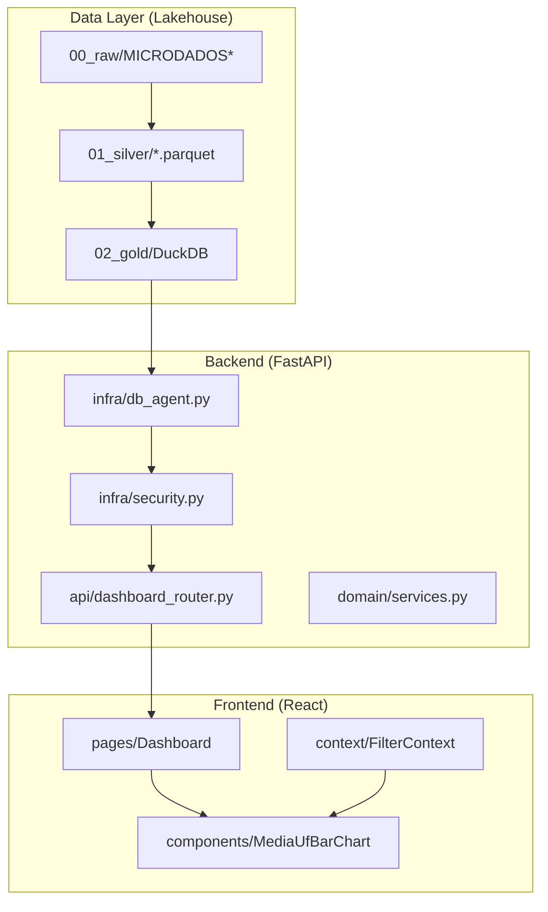

# Checklist de Staff Engineer  

**Funcionalidade:** Quantificação de alunos por média nas 5 disciplinas, com filtro por UF  
**Projeto:** ENEM Data Robotics v2  
**Responsável técnico:** _[preencher]_  
**Versão:** 2.0 – Revisado com conceitos avançados de Engenharia de Software  
**Data de revisão:** 2025-12-11

---

## Sumário

1. [Alinhamento de Objetivo e Escopo](#1-alinhamento-de-objetivo-e-escopo)
2. [Requisitos de Negócio e Produto](#2-requisitos-de-negócio-e-produto)
3. [Regras de Negócio (Média, Faixas, Filtros)](#3-regras-de-negócio-média-faixas-filtros)
4. [Modelagem de Dados e Arquitetura Lakehouse](#4-modelagem-de-dados-e-arquitetura-lakehouse)
5. [Qualidade de Dados e Data Contracts](#5-qualidade-de-dados-e-data-contracts)
6. [Arquitetura de Software e Pipeline](#6-arquitetura-de-software-e-pipeline)
7. [Performance, Escalabilidade e Latência](#7-performance-escalabilidade-e-latência)
8. [Segurança, Governança e Conformidade LGPD](#8-segurança-governança-e-conformidade-lgpd)
9. [Observabilidade, Logging e Monitoramento](#9-observabilidade-logging-e-monitoramento)
10. [Estratégia de Testes Multi-layer](#10-estratégia-de-testes-multi-layer)
11. [Experiência UI/UX e Acessibilidade](#11-experiência-uiux-e-acessibilidade)
12. [CI/CD, Deploy e Rollback](#12-cicd-deploy-e-rollback)
13. [Manutenibilidade e Débito Técnico](#13-manutenibilidade-e-débito-técnico)
14. [Comunicação e Governança de Times](#14-comunicação-e-governança-de-times)

---

## 1. Alinhamento de Objetivo e Escopo

### 1.1 Clareza de Objetivo

- [ ] **Objective Key Results (OKRs)** definidos e mensuráveis
  - Exemplo: "Reduzir tempo de análise de distribuição de alunos por UF de 2h para 5 minutos"

- [ ] **Problema de negócio** claramente articulado e documentado
  - "Distribuição de alunos por faixa de média nas 5 disciplinas, por UF, com filtro por ano"

- [ ] **Stakeholders** identificados com matriz RACI
  - Responsável, Accountable, Consultado, Informado

- [ ] **Success criteria** quantificáveis estabelecidos
  - Ex.: "Usuário consegue comparar UFs e exportar resultados em < 3 cliques"

### 1.2 Definição de Escopo

- [ ] **Escopo incluído** explicitamente listado
  - Cálculo de média, faixas, agregação, endpoint `/v1/dados/media-uf`, componente React

- [ ] **Escopo excluído (Out of scope)** claramente registrado
  - Sem pesos por disciplina, sem modelos preditivos, sem TRI detalhada

- [ ] **Critérios de aceitação (DoD - Definition of Done)** acordados
  - Pipeline executando, testes passando, documentação atualizada

- [ ] **Trade-offs técnicos** documentados e aceitos
  - Ex.: "Usar agregação pré-computada em detrimento de flexibilidade de queries ad-hoc"

---

## 2. Requisitos de Negócio e Produto

### 2.1 Requisitos Funcionais

- [ ] **User stories** ou **Job stories** documentadas
  - "Como analista, quero ver quantos alunos do Estado X estão na faixa 600-800 em 2023"

- [ ] **Casos de uso** mapeados com fluxos principais e alternativos

- [ ] **Personas** de usuários identificadas
  - Analistas de dados, gestores educacionais, pesquisadores

- [ ] **Granularidade de saída** definida
  - Agregação por UF × ano × faixa de média

### 2.2 Decisões de Produto

- [ ] **Ambiguidades resolvidas** e documentadas como ADRs (Architecture Decision Records)
  - Qual UF usar (residência, escola, local de prova)?
  - Tratamento de UF desconhecida?

- [ ] **Priorização** de funcionalidades (MoSCoW ou similar)

- [ ] **Roadmap** alinhado com milestones de entrega

---

## 3. Regras de Negócio (Média, Faixas, Filtros)

### 3.1 Cálculo da Média das 5 Disciplinas

- [ ] **Fórmula canônica** documentada e versionada

  ```text
  media_5_disc = (nota_ling + nota_mat + nota_ch + nota_cn + nota_red) / 5
  ```

- [ ] **Precisão numérica** definida (2 casas decimais, `FLOAT64`)

- [ ] **Edge cases** tratados e testados
  - Nota nula → excluir do cálculo + flag `dados_incompletos`
  - Nota `0` → validar se é ausência ou nota válida

- [ ] **Fonte única de verdade (SSOT)** para a fórmula
  - Implementar em `enem_project.domain.services.calcular_media_5_disc()`

### 3.2 Faixas de Média (Parametrizáveis)

- [ ] **Faixas padrão** revisadas e aprovadas por stakeholders

  | Faixa | Intervalo   | Descrição         |
  |-------|-------------|-------------------|
  | 1     | [0, 400)    | Abaixo de 400     |
  | 2     | [400, 600)  | Intermediário baixo|
  | 3     | [600, 800)  | Intermediário alto |
  | 4     | [800, 1000] | Alto desempenho   |

- [ ] **Configuração externalizada** em `config/faixas_media.yaml`
  - Não usar magic numbers hardcoded

- [ ] **Regras de borda** documentadas
  - 400 ∈ [400, 600); 800 ∈ [800, 1000]

- [ ] **Validação de invariantes** implementada
  - Faixas devem cobrir range completo [0, 1000] sem gaps

### 3.3 UF e Filtros

- [ ] **Campo UF** de referência definido (coluna/tabela específica)

- [ ] **Estratégia para UF nula/inválida** documentada
  - Agrupar em `UF_DESCONHECIDA` com logging para auditoria

- [ ] **Filtros** classificados por prioridade
  - Obrigatórios: UF, ano
  - Opcionais: tipo de escola (pública/privada)

---

## 4. Modelagem de Dados e Arquitetura Lakehouse

### 4.1 Lakehouse Architecture (Medallion)

- [ ] **Raw Layer (Bronze)** preservada e imutável
  - `data/00_raw/` → nunca modificar arquivos originais

- [ ] **Silver Layer** implementada
  - Dados limpos, padronizados em Parquet
  - Schema versionado com schema evolution suportada

- [ ] **Gold Layer** produzindo datasets analíticos
  - Tabelas agregadas prontas para consumo

### 4.2 Schema Design

- [ ] **Tabela `fato_notas_enem`** possui todos os campos necessários
  - `id_aluno`, `ano_enem`, `uf`, `nota_*`, `media_5_disc`

- [ ] **Coluna `media_5_disc`** modelada com tipo adequado
  - `FLOAT64` ou `DECIMAL(6,2)` documentado no data dictionary

- [ ] **Dimensão de faixas (`dim_faixa_media`)** definida
  - `id_faixa`, `limite_inferior`, `limite_superior`, `descricao`

- [ ] **Tabela agregada (`agg_media5_por_uf`)** desenhada

  ```yaml
  schema:
    ano_enem: INT32
    uf: STRING (2 chars, uppercase)
    id_faixa: INT8
    descricao_faixa: STRING
    qtd_alunos: INT64
    dt_processamento: TIMESTAMP
  ```

- [ ] **Relacionamentos** documentados com diagrama ER

- [ ] **Particionamento** por `ano_enem` para otimização de queries

---

## 5. Qualidade de Dados e Data Contracts

### 5.1 Data Quality Checks (Soda Core)

- [ ] **Checks de completude** implementados
  - `missing_count(ano_enem) = 0`
  - `missing_count(uf) = 0`

- [ ] **Checks de domínio/range** implementados
  - Notas no range [0, 1000]
  - UF válida (siglas de 27 estados + DF)

- [ ] **Checks de unicidade** onde aplicável
  - `id_aluno` + `ano_enem` único na tabela base

- [ ] **Checks derivados/agregados** implementados
  - Soma das faixas = total de alunos elegíveis por UF

### 5.2 Data Contracts

- [ ] **Schema contract** definido entre produtor e consumidor

  ```yaml
  # soda/contracts/agg_media5_por_uf.yml
  contract:
    producer: "pipeline-gold"
    consumer: "api-fastapi"
    sla: "dados atualizados até D+1"
  ```

- [ ] **Breaking changes** comunicados com antecedência

- [ ] **Volume de descarte** monitorado e categorizado por motivo

### 5.3 Data Lineage

- [ ] **Linhagem de dados** documentada (raw → silver → gold)

- [ ] **Metadados de versão** capturados em cada execução
  - Versão do código, timestamp, parâmetros

---

## 6. Arquitetura de Software e Pipeline

### 6.1 Princípios SOLID Aplicados

- [ ] **Single Responsibility (SRP)** respeitado
  - Módulos separados: `data/`, `domain/`, `api/`, `infra/`

- [ ] **Open/Closed (OCP)** considerado
  - Faixas configuráveis sem alterar código

- [ ] **Dependency Inversion (DIP)** aplicado
  - Abstrações para IO, não dependências concretas

### 6.2 Separação de Camadas (Clean Architecture Lite)

- [ ] **Infra Layer** isolada
  - `enem_project.infra.io`, `enem_project.infra.db`
  - Nunca usar `open()` ou `pd.read_csv` diretamente no negócio

- [ ] **Domain Layer** pura
  - `enem_project.domain.services` sem dependências de IO
  - Funções puras testáveis

- [ ] **Application Layer (API)**
  - `enem_project.api.dashboard_router` orquestra chamadas

- [ ] **Paths centralizados** via `enem_project.config.paths`

### 6.3 Pipeline Architecture

- [ ] **Pipeline encaixa** na arquitetura existente sem workarounds
  - Fluxo: tratamento → cálculo média → classificação faixas → agregação

- [ ] **Dependências entre jobs** mapeadas como DAG

- [ ] **Lógica de faixas não duplicada** (DRY)
  - Fonte única em `domain/services.py`

- [ ] **Output compatível** com BI tools e APIs existentes

### 6.4 Orquestração Agêntica (Opcional)

- [ ] **Workflows** implementados em `orchestrator/workflows/`

- [ ] **Agents** modulares e reutilizáveis

- [ ] **Contexto compartilhado** com controle de acesso

---

## 7. Performance, Escalabilidade e Latência

### 7.1 Metas de Performance (SLOs)

| Operação | P50 | P95 | P99 |
|----------|-----|-----|-----|
| GET `/v1/dados/media-uf` (cached) | < 50ms | < 100ms | < 200ms |
| GET `/v1/dados/media-uf` (uncached) | < 200ms | < 500ms | < 1s |
| Pipeline batch completo | - | - | < 5 min |

- [ ] **SLOs documentados** e acordados com stakeholders

- [ ] **SLIs (indicators)** implementados para medir SLOs

### 7.2 Estratégias de Otimização

#### Backend

- [ ] **Pré-agregação** em batch (Parquet na Gold)
  - Reduz queries em runtime em ~90%

- [ ] **Índices e particionamento** adequados
  - Parquet particionado por `ano_enem`

- [ ] **Query caching** implementado com TTL apropriado (5min)

- [ ] **Connection pooling** para DuckDB

- [ ] **Resource limits** via PRAGMAs DuckDB
  ```sql
  SET memory_limit='2GB';
  SET threads=4;
  ```

#### Frontend

- [ ] **Lazy loading** de componentes pesados

- [ ] **Memoization** (`useMemo`, `useCallback`, `React.memo`)

- [ ] **Bundle splitting** para gráficos
  - Chart component < 50KB gzipped

### 7.3 Escalabilidade

- [ ] **Volume atual e projetado** estimado
  - ~5M registros/ano × 27 anos = ~135M registros

- [ ] **Concorrência suportada** (100 req/s)

- [ ] **Horizontal scaling ready** (stateless API)

- [ ] **Novos anos do ENEM** suportados sem alteração de código

---

## 8. Segurança, Governança e Conformidade LGPD

### 8.1 Autenticação e Autorização

- [ ] **Autenticação** via JWT Bearer token obrigatório

- [ ] **Authorization** baseada em roles (RBAC) implementada

- [ ] **Rate limiting** configurado (60 req/min por IP)

### 8.2 Prevenção de Vulnerabilidades

- [ ] **SQL Injection Prevention** com queries parametrizadas

  ```python
  # ❌ NUNCA
  sql = f"SELECT * FROM agg WHERE uf = '{uf}'"
  
  # ✅ SEMPRE
  sql = "SELECT * FROM agg WHERE uf = ?"
  agent.run_query(sql, params=[uf])
  ```

- [ ] **Input validation** rigorosa via Pydantic

  ```python
  class MediaUfRequest(BaseModel):
      ano: int = Field(..., ge=1998, le=2024)
      uf: str | None = Field(None, pattern=r"^[A-Z]{2}$")
  ```

- [ ] **Guardrails de segurança** no `DuckDBAgent`
  - `read_only=True` para queries da API

- [ ] **SAST/DAST** integrado no CI/CD

### 8.3 Privacidade e LGPD

- [ ] **Nível de anonimização/agregação** adequado
  - Dados expostos são sempre agregados, nunca PII direto

- [ ] **Classificação de dados** por sensibilidade
  - `RAW`, `SENSITIVE`, `AGGREGATED`

- [ ] **Políticas de retenção** respeitadas

- [ ] **Data masking** implementado onde necessário

### 8.4 Auditoria

- [ ] **Logs de auditoria** estruturados para SIEM

  ```python
  logger.info(
      "media_uf_query",
      extra={
          "user_id": current_user.id,
          "ano": ano,
          "uf": uf,
          "response_time_ms": elapsed,
      }
  )
  ```

- [ ] **Rastreabilidade** de execuções por `run_id`

---

## 9. Observabilidade, Logging e Monitoramento

### 9.1 Logging Estruturado

- [ ] **Logs em JSON** para integração com ELK/Splunk

- [ ] **Níveis adequados** (`INFO`, `WARNING`, `ERROR`)

- [ ] **Contexto de execução** presente em todos os logs
  - `run_id`, `timestamp`, `versão do código`

- [ ] **Logs de pipeline** cobrem:
  - Total de alunos lidos
  - Elegíveis processados
  - Descartados por motivo
  - Tempo por etapa

### 9.2 Métricas e Monitoring

- [ ] **Métricas de aplicação** expostas (Prometheus-ready)

  | Categoria | Métrica | Tipo |
  |-----------|---------|------|
  | Pipeline  | `alunos_processados_total` | Counter |
  | Pipeline  | `alunos_descartados_total` | Counter |
  | Pipeline  | `pipeline_duration_seconds` | Histogram |
  | API       | `http_requests_total` | Counter |
  | API       | `http_request_duration_seconds` | Histogram |
  | Cache     | `cache_hit_ratio` | Gauge |

- [ ] **Dashboards de observabilidade** criados (Grafana ou similar)

### 9.3 Tracing e Alertas

- [ ] **Distributed tracing** ready (OpenTelemetry)

- [ ] **Alertas críticos** configurados

  | Condição | Severidade | Ação |
  |----------|------------|------|
  | Latência P95 > 1s | Warning | Investigar query |
  | Error rate > 5% | Critical | Rollback |
  | Pipeline > 10 min | Warning | Otimizar |

---

## 10. Estratégia de Testes Multi-layer

### 10.1 Pirâmide de Testes

```text
         🌐 E2E (Playwright)
       ────────────────────
        🔗 Integração (Pytest)
      ────────────────────────
       🧪 Unitários (Pytest)
     ──────────────────────────
      📐 Estático (Mypy/Ruff)
```

### 10.2 Testes Unitários

- [ ] **Cobertura > 80%** em módulos críticos

- [ ] **Cálculo de média** testado

  ```python
  def test_media_correta_5_notas_completas():
      df = pl.DataFrame({...})
      result = calcular_media_5_disc(df)
      assert result["media_5_disc"][0] == 660.0
  ```

- [ ] **Classificação de faixas** testada (incluindo bordas)

  ```python
  @pytest.mark.parametrize("media,faixa_esperada", [
      (350.0, 1), (400.0, 2), (599.9, 2),
      (600.0, 3), (800.0, 4), (1000.0, 4)
  ])
  def test_classificacao_correta(media, faixa_esperada):
      assert classificar_faixa_media(media) == faixa_esperada
  ```

- [ ] **Edge cases** testados (nulls, zeros, extremos)

### 10.3 Testes de Integração

- [ ] **Pipeline ponta-a-ponta** testado com dados amostrais

- [ ] **Endpoint API** testado com HTTPx/AsyncClient

  ```python
  async def test_get_media_uf_sucesso(auth_client):
      response = await auth_client.get(
          "/v1/dados/media-uf",
          params={"ano": 2023, "uf": "SP"}
      )
      assert response.status_code == 200
  ```

- [ ] **Rate limiting** validado

### 10.4 Testes E2E (Playwright)

- [ ] **Fluxos críticos de usuário** cobertos
  - Filtrar por UF, visualizar gráfico, exportar dados

- [ ] **Cross-browser** testing (Chrome, Firefox)

- [ ] **Screenshots de regressão** capturados

### 10.5 Testes de Dados (Soda Core)

- [ ] **Data quality checks** automatizados

  ```yaml
  checks for agg_media5_por_uf:
    - row_count > 0
    - missing_count(ano_enem) = 0
    - values in (id_faixa) must be in [1, 2, 3, 4]
  ```

### 10.6 Execution Commands

```bash
# Testes unitários
poetry run pytest tests/unit -v --cov=enem_project

# Testes de integração
poetry run pytest tests/integration -v

# Testes E2E
cd dashboard && npx playwright test

# Soda checks
poetry run soda scan -d enem_gold soda/checks/agg_media5_por_uf.yml
```

---

## 11. Experiência UI/UX e Acessibilidade

### 11.1 Princípios de Design

- [ ] **Clareza visual** com legendas e tooltips informativos

- [ ] **Feedback imediato** via skeletons e loading states

- [ ] **Responsividade** (desktop, tablet, mobile)

- [ ] **Acessibilidade WCAG 2.1 AA** (Radix UI primitives)

### 11.2 Estados de Interface

- [ ] **Loading state** com skeleton cards

- [ ] **Empty state** com ilustração e mensagem amigável

- [ ] **Error state** com Error Boundary e retry button

- [ ] **Success state** com animação suave de entrada (300ms)

### 11.3 Componentes Visuais

- [ ] **MediaUfBarChart** implementado com cores semânticas

  ```css
  --faixa-1: #ef4444; /* 0-400: Vermelho */
  --faixa-2: #f97316; /* 400-600: Laranja */
  --faixa-3: #22c55e; /* 600-800: Verde */
  --faixa-4: #3b82f6; /* 800-1000: Azul */
  ```

- [ ] **Filtros interativos** com comportamento consistente

- [ ] **Tooltips detalhados** ao hover

### 11.4 Performance de UI

- [ ] **First Contentful Paint (FCP)** < 1.5s

- [ ] **Largest Contentful Paint (LCP)** < 2.5s

- [ ] **Cumulative Layout Shift (CLS)** < 0.1

---

## 12. CI/CD, Deploy e Rollback

### 12.1 Pipeline de CI

- [ ] **Lint e formatação** (Ruff, Black, ESLint)

- [ ] **Type checking** (Mypy, TypeScript)

- [ ] **Testes automatizados** em cada PR

- [ ] **Security scanning** (SAST)

- [ ] **Code coverage** gates (> 80%)

### 12.2 Estratégia de Deploy

- [ ] **Estratégia de rollout** definida
  - Dev → Staging → Production com validações em cada fase

- [ ] **Feature flags** para rollout gradual (se aplicável)

- [ ] **Canary/Blue-Green** deployment ready

### 12.3 Rollback Plan

- [ ] **Plano de rollback** documentado
  - Como desativar a feature
  - Como reverter tabelas/dados
  - Tempo máximo para rollback (RTO)

- [ ] **Runbook de incidentes** criado

### 12.4 Primeiro Deploy (First Run)

- [ ] **Anos iniciais** definidos para processamento

- [ ] **Smoke tests** post-deploy automatizados

- [ ] **Health checks** configurados

---

## 13. Manutenibilidade e Débito Técnico

### 13.1 Code Quality

- [ ] **Pre-commit hooks** configurados (`.pre-commit-config.yaml`)

- [ ] **Type hints** em todas as funções públicas

- [ ] **Docstrings** em módulos e funções principais

- [ ] **Complexidade ciclomática** monitorada

### 13.2 Configuração Externalizada

- [ ] **Faixas de média** via YAML, não hardcoded

- [ ] **Disciplinas** configuráveis

- [ ] **Parâmetros de cache** externalizados

### 13.3 Documentação Técnica

- [ ] **README** atualizado com setup e comandos

- [ ] **ADRs** para decisões arquiteturais

- [ ] **API docs** gerados automaticamente (OpenAPI)

- [ ] **Data dictionary** mantido

### 13.4 Débito Técnico

- [ ] **Tech debt backlog** mantido e priorizado

- [ ] **Refactoring** planejado em sprints

---

## 14. Comunicação e Governança de Times

### 14.1 Alinhamento entre Times

- [ ] **Times envolvidos** identificados e alinhados
  - Engenharia de Dados, Backend, Frontend, Produto

- [ ] **Reuniões de sync** agendadas

- [ ] **Canais de comunicação** definidos (Slack, etc.)

### 14.2 Documentação Acessível

- [ ] **Documentação em local oficial** (Wiki, Notion, Confluence)

- [ ] **Decisões registradas** como ADRs
  - Tratamento de UF nula
  - Definição de faixas e bordas

- [ ] **Onboarding guide** para novos membros

### 14.3 Knowledge Sharing

- [ ] **Stakeholders sabem onde consultar:**
  - Definição da média
  - Definição de faixas
  - Exemplos de queries e uso

- [ ] **Sessões de demo** planejadas

- [ ] **Postmortem** process definido para incidentes

---

## Anexo A: Referência Rápida de Comandos

```bash
# Backend
poetry run uvicorn enem_project.api.main:app --reload --port 8000
poetry run pytest tests/ -v --cov=enem_project

# Frontend
cd dashboard && npm run dev
cd dashboard && npx playwright test

# Pipeline
poetry run enem etl-raw-to-silver --ano 2023
poetry run enem build-gold

# Quality Checks
poetry run soda scan -d enem_gold soda/checks/
```

---

## Anexo B: Diagrama de Arquitetura



---

**Última atualização:** 2025-12-11  
**Autor:** Staff Engineer / Arquitetura ENEM Data Robotics v2
