# Documento de Engenharia Frontend – ENEM Data Robotics V2

> **Versão:** 1.0  
> **Data:** 2025-12-11  
> **Autor:** Engenharia de Software  
> **Stack:** React 18 + Vite 7 + TypeScript + Playwright

---

## 1. Visão Geral da Arquitetura Frontend

### 1.1 Stack Tecnológica

| Categoria | Tecnologia | Versão | Justificativa |
|-----------|------------|--------|---------------|
| Framework | React | 18.3.1 | Componentes declarativos, ecossistema maduro |
| Bundler | Vite | 7.2.4 | HMR ultra-rápido, ESM nativo |
| Linguagem | TypeScript | 5.4.0 | Tipagem estática, `strict: true` |
| Estilização | Tailwind CSS | 3.4.1 | Utility-first, integração Chakra UI |
| UI Primitivos | Radix UI + Chakra UI | 2.x | Acessibilidade WCAG, headless |
| Animações | Framer Motion | 10.18 | Transições fluidas de página |
| Visualização | AmCharts 5, Highcharts, D3.js, Plotly | - | Mapas coropletas, gráficos complexos |
| Testes E2E | Playwright | 1.40 | Cross-browser, visual testing |

### 1.2 Estrutura de Diretórios

```
dashboard/
├── src/
│   ├── api/            # Cliente HTTP centralizado
│   │   ├── client.ts   # Interceptors, token injection
│   │   └── dashboard.ts # Endpoints específicos
│   ├── components/     
│   │   ├── ui/         # 17 componentes primitivos (shadcn pattern)
│   │   ├── layout/     # Sidebar, Topbar, PageTransition
│   │   └── *.tsx       # 19 componentes de negócio (charts, maps)
│   ├── context/        # Estado global (Auth, Filter, Layout)
│   ├── pages/          # 4 páginas (Login, Signup, Dashboard, Advanced)
│   ├── types/          # Interfaces TypeScript
│   └── lib/            # Utilitários (cn, formatters)
├── e2e/                # Testes End-to-End
├── playwright.config.ts
├── vite.config.ts      # Proxy, aliases, optimizeDeps
└── tsconfig.json       # strict: true
```

---

## 2. Sistema de Testes Automatizados

### 2.1 Estratégia de Testes (Pirâmide)

```mermaid
graph TB
    subgraph "Pirâmide de Testes Frontend"
        E2E["🌐 E2E (Playwright)"]
        Integration["🔗 Integração (Vitest + MSW)"]
        Unit["🧪 Unitários (Vitest)"]
        Static["📐 Análise Estática (TypeScript + ESLint)"]
    end
    
    Static --> Unit --> Integration --> E2E
```



### 2.2 Testes E2E Existentes

| Arquivo | Cobertura | Status |
|---------|-----------|--------|
| `e2e/navigation.spec.ts` | Fluxo completo de auth + navegação | ✅ Ativo |

**Cenários Cobertos:**
- Título da aplicação
- Fluxo completo: Signup → Login → Dashboard → Explorador Avançado

**Execução:**
```bash
cd dashboard
npx playwright test
npx playwright test --ui          # Interface visual
npx playwright show-report        # Relatório HTML
```

### 2.3 Testes Recomendados (A Implementar)

#### 2.3.1 Testes Unitários (Vitest)

```typescript
// tests/api/client.spec.ts
import { apiClient, ApiError } from '@/api/client';
import { describe, it, expect, vi } from 'vitest';

describe('apiClient', () => {
  it('should inject Authorization header when token exists', async () => {
    localStorage.setItem('access_token', 'test-token');
    // Mock fetch and verify headers
  });

  it('should handle 401 and dispatch auth:logout event', async () => {
    // Mock 401 response
    const logoutSpy = vi.fn();
    window.addEventListener('auth:logout', logoutSpy);
    // Verify event dispatch
  });

  it('should handle 429 rate limit with Retry-After', async () => {
    // Mock 429 with Retry-After header
    // Verify toast message and error thrown
  });
});
```

#### 2.3.2 Testes de Integração

```typescript
// tests/components/NotasAmMap.integration.spec.tsx
import { render, waitFor } from '@testing-library/react';
import { NotasAmMap } from '@/components/NotasAmMap';
import { rest } from 'msw';
import { setupServer } from 'msw/node';

const server = setupServer(
  rest.get('/v1/dados/mapa', (req, res, ctx) => {
    return res(ctx.json({ /* mock data */ }));
  })
);

describe('NotasAmMap Integration', () => {
  it('renders map with API data', async () => {
    const { container } = render(<NotasAmMap />);
    await waitFor(() => {
      expect(container.querySelector('.am5-container')).toBeTruthy();
    });
  });
});
```

#### 2.3.3 Novos Testes E2E

```typescript
// e2e/security.spec.ts
import { test, expect } from '@playwright/test';

test.describe('Security Tests', () => {
  test('should redirect unauthenticated users to login', async ({ page }) => {
    await page.goto('/dashboard');
    await expect(page).toHaveURL(/.*\/login/);
  });

  test('should clear tokens on logout', async ({ page }) => {
    // Login first
    await page.goto('/login');
    // ... perform login
    
    // Logout
    await page.getByRole('button', { name: /logout|sair/i }).click();
    
    // Verify localStorage is cleared
    const token = await page.evaluate(() => localStorage.getItem('access_token'));
    expect(token).toBeNull();
  });

  test('should handle expired token gracefully', async ({ page }) => {
    // Set expired/invalid token
    await page.evaluate(() => {
      localStorage.setItem('access_token', 'invalid-token');
    });
    
    await page.goto('/dashboard');
    // Should redirect to login after 401
    await expect(page).toHaveURL(/.*\/login/);
  });
});
```

### 2.4 Configuração Vitest (A Adicionar)

```typescript
// vitest.config.ts
import { defineConfig } from 'vitest/config';
import react from '@vitejs/plugin-react-swc';
import path from 'path';

export default defineConfig({
  plugins: [react()],
  test: {
    globals: true,
    environment: 'jsdom',
    setupFiles: ['./tests/setup.ts'],
    coverage: {
      provider: 'v8',
      reporter: ['text', 'json', 'html'],
      exclude: ['node_modules', 'e2e']
    }
  },
  resolve: {
    alias: {
      '@': path.resolve(__dirname, './src')
    }
  }
});
```

---

## 3. Segurança e Criptografia

### 3.1 Análise de Vulnerabilidades

#### 3.1.1 Implementações Existentes ✅

| Controle | Implementação | Arquivo |
|----------|---------------|---------|
| **Token JWT** | Bearer token via localStorage | `api/client.ts:26-34` |
| **Rate Limiting** | Handler 429 com Retry-After | `api/client.ts:42-55` |
| **Session Expiry** | Handler 401 com logout automático | `api/client.ts:57-63` |
| **Protected Routes** | Redirect não autenticado | `App.tsx:25-27` |
| **Error Boundary** | Captura erros React | `main.tsx:45` |

#### 3.1.2 Vulnerabilidades Identificadas ⚠️

| Severidade | Issue | Recomendação |
|------------|-------|--------------|
| 🔴 **Alta** | Token JWT em localStorage | Migrar para httpOnly cookies ou sessionStorage + refresh rotation |
| 🟡 **Média** | Sem CSP Headers | Adicionar via `vite.config.ts` headers ou nginx |
| 🟡 **Média** | Sem sanitização XSS em inputs | Adicionar DOMPurify para campos dinâmicos |
| 🟢 **Baixa** | `allowedHosts: true` em dev | OK para dev, remover em produção |

### 3.2 Recomendações de Segurança

#### 3.2.1 Content Security Policy (CSP)

```typescript
// vite.config.ts - Adicionar para produção
export default defineConfig({
  // ...
  build: {
    rollupOptions: {
      output: {
        manualChunks: {
          vendor: ['react', 'react-dom'],
          charts: ['highcharts', 'd3', 'plotly.js']
        }
      }
    }
  },
  // Headers CSP via plugin ou servidor
});
```

**Headers recomendados (nginx/Cloudflare):**
```nginx
Content-Security-Policy: 
  default-src 'self';
  script-src 'self' 'unsafe-inline' 'unsafe-eval';  # AmCharts requer eval
  style-src 'self' 'unsafe-inline' https://fonts.googleapis.com;
  font-src 'self' https://fonts.gstatic.com;
  img-src 'self' data: blob:;
  connect-src 'self' https://api.example.com;
```

#### 3.2.2 Migração de Token Storage

```typescript
// Proposta: Secure Token Handling
// api/secureStorage.ts

const ENCRYPTION_KEY = 'your-encryption-key'; // Via env

export const secureStorage = {
  setToken: (token: string) => {
    // Opção 1: sessionStorage (mais seguro que localStorage)
    sessionStorage.setItem('access_token', token);
    
    // Opção 2: Memory only (mais seguro, perde em refresh)
    // window.__TOKEN__ = token;
  },
  
  getToken: () => {
    return sessionStorage.getItem('access_token');
  },
  
  clearTokens: () => {
    sessionStorage.removeItem('access_token');
    sessionStorage.removeItem('refresh_token');
  }
};
```

### 3.3 Checklist de Segurança

```markdown
- [x] Autenticação JWT implementada
- [x] Proteção de rotas (ProtectedLayout)
- [x] Handler de Rate Limit
- [x] Handler de Session Expiry
- [ ] CSP Headers configurados
- [ ] Migração localStorage → sessionStorage
- [ ] Sanitização XSS (DOMPurify)
- [ ] Audit de dependências (`npm audit`)
- [ ] HTTPS enforced (produção)
- [ ] Secure/SameSite cookies (se usar cookies)
```

---

## 4. Performance e Latência

### 4.1 Métricas Atuais (Baseline)

| Métrica | Alvo | Status |
|---------|------|--------|
| **FCP** (First Contentful Paint) | < 1.8s | ⏳ Medir |
| **LCP** (Largest Contentful Paint) | < 2.5s | ⏳ Medir |
| **CLS** (Cumulative Layout Shift) | < 0.1 | ⏳ Medir |
| **TTI** (Time to Interactive) | < 3.8s | ⏳ Medir |
| **Bundle Size** | < 500KB gzip | ⏳ Medir |

### 4.2 Otimizações Implementadas ✅

| Técnica | Implementação |
|---------|---------------|
| **SWC Compiler** | `@vitejs/plugin-react-swc` (10x mais rápido que Babel) |
| **Dependency Pre-bundling** | `optimizeDeps.include` para charts pesados |
| **Code Splitting** | React.lazy natural via rotas |
| **Proxy Local** | Elimina CORS overhead em dev |

### 4.3 Otimizações Recomendadas

#### 4.3.1 Lazy Loading de Charts Pesados

```typescript
// components/LazyCharts.tsx
import { lazy, Suspense } from 'react';
import { Skeleton } from '@/components/ui/skeleton';

// Lazy load componentes de ~50KB+ cada
export const NotasAmMap = lazy(() => import('./NotasAmMap'));
export const NotasHeatmap = lazy(() => import('./NotasHeatmap'));
export const RaceHistoryChart = lazy(() => import('./RaceHistoryChart'));

export const ChartWrapper = ({ children }: { children: React.ReactNode }) => (
  <Suspense fallback={<Skeleton className="h-96 w-full rounded-lg" />}>
    {children}
  </Suspense>
);
```

#### 4.3.2 Virtual Scrolling para Tabelas Grandes

```typescript
// Para NotasGeoTable com 5570 municípios
import { useVirtualizer } from '@tanstack/react-virtual';

function VirtualTable({ data }: { data: Municipality[] }) {
  const parentRef = useRef<HTMLDivElement>(null);
  
  const rowVirtualizer = useVirtualizer({
    count: data.length,
    getScrollElement: () => parentRef.current,
    estimateSize: () => 48, // altura da row
    overscan: 10
  });
  
  // Renderiza apenas rows visíveis
}
```

#### 4.3.3 API Response Caching

```typescript
// hooks/useApiCache.ts
import { useState, useEffect, useRef } from 'react';

const cache = new Map<string, { data: any; timestamp: number }>();
const TTL = 5 * 60 * 1000; // 5 minutos

export function useCachedFetch<T>(key: string, fetcher: () => Promise<T>) {
  const [data, setData] = useState<T | null>(null);
  const [isLoading, setIsLoading] = useState(true);

  useEffect(() => {
    const cached = cache.get(key);
    if (cached && Date.now() - cached.timestamp < TTL) {
      setData(cached.data);
      setIsLoading(false);
      return;
    }

    fetcher().then((result) => {
      cache.set(key, { data: result, timestamp: Date.now() });
      setData(result);
      setIsLoading(false);
    });
  }, [key]);

  return { data, isLoading };
}
```

### 4.4 Análise de Bundle

```bash
# Gerar relatório de bundle
cd dashboard
npm run build -- --mode production
npx vite-bundle-visualizer

# Lighthouse CI
npm install -g @lhci/cli
lhci autorun --upload.target=filesystem --upload.outputDir=./lhci
```

---

## 5. Análise e Prevenção de Bugs

### 5.1 Bugs Conhecidos e Mitigações

| ID | Descrição | Severidade | Mitigação |
|----|-----------|------------|-----------|
| BUG-001 | Filtros resetam em navegação | 🟡 Média | Persistir estado em URL params |
| BUG-002 | Mapa não renderiza em telas < 768px | 🔴 Alta | Media query + resize listener |
| BUG-003 | Memory leak em charts não desmontados | 🔴 Alta | Implementar cleanup em useEffect |

### 5.2 Práticas de Prevenção

#### 5.2.1 TypeScript Strict Mode

```json
// tsconfig.json (já implementado)
{
  "compilerOptions": {
    "strict": true,
    "forceConsistentCasingInFileNames": true,
    "noImplicitReturns": true,
    "noFallthroughCasesInSwitch": true,
    "noUncheckedIndexedAccess": true  // ADICIONAR
  }
}
```

#### 5.2.2 Error Boundary por Feature

```typescript
// components/ChartErrorBoundary.tsx
import { Component, ReactNode } from 'react';
import { AlertTriangle } from 'lucide-react';

interface Props {
  children: ReactNode;
  fallbackMessage?: string;
}

interface State {
  hasError: boolean;
  error?: Error;
}

export class ChartErrorBoundary extends Component<Props, State> {
  state: State = { hasError: false };

  static getDerivedStateFromError(error: Error) {
    return { hasError: true, error };
  }

  componentDidCatch(error: Error, info: React.ErrorInfo) {
    console.error('Chart Error:', error, info);
    // Enviar para Sentry/LogRocket
  }

  render() {
    if (this.state.hasError) {
      return (
        <div className="flex flex-col items-center justify-center h-64 bg-red-50 rounded-lg">
          <AlertTriangle className="h-8 w-8 text-red-500" />
          <p className="mt-2 text-red-700">
            {this.props.fallbackMessage || 'Erro ao carregar visualização'}
          </p>
        </div>
      );
    }
    return this.props.children;
  }
}
```

#### 5.2.3 Cleanup Pattern para Charts

```typescript
// Pattern para componentes AmCharts/D3
useEffect(() => {
  const root = am5.Root.new(chartRef.current!);
  
  // Setup chart...
  
  return () => {
    // CRÍTICO: Dispose para evitar memory leak
    root.dispose();
  };
}, [dependencies]);
```

### 5.3 Ferramentas de Qualidade

| Ferramenta | Propósito | Comando |
|------------|-----------|---------|
| **TypeScript** | Type checking | `tsc --noEmit` |
| **ESLint** | Linting | `eslint src --ext .ts,.tsx` |
| **Prettier** | Formatação | `prettier --check src` |
| **npm audit** | Vulnerabilidades deps | `npm audit --production` |

---

## 6. Observabilidade e Monitoramento

### 6.1 Stack Recomendada


### 6.2 Integração Sentry

```typescript
// main.tsx - Setup básico
import * as Sentry from '@sentry/react';

Sentry.init({
  dsn: import.meta.env.VITE_SENTRY_DSN,
  integrations: [
    Sentry.browserTracingIntegration(),
    Sentry.replayIntegration()
  ],
  tracesSampleRate: 0.1,
  replaysSessionSampleRate: 0.1,
  replaysOnErrorSampleRate: 1.0,
  environment: import.meta.env.MODE
});

// Wrap App
<Sentry.ErrorBoundary fallback={<ErrorFallback />}>
  <App />
</Sentry.ErrorBoundary>
```

### 6.3 Métricas de Uso

```typescript
// hooks/useAnalytics.ts
export function trackEvent(name: string, properties?: Record<string, any>) {
  // Para Plausible
  if (window.plausible) {
    window.plausible(name, { props: properties });
  }
  
  // Ou GA4
  if (window.gtag) {
    window.gtag('event', name, properties);
  }
}

// Uso
trackEvent('chart_viewed', { type: 'heatmap', year: 2023 });
```

---

## 7. Comandos de Operação

### 7.1 Desenvolvimento

```bash
# Iniciar frontend + backend
cd dashboard && npm run dev

# Apenas frontend
npm run dev:frontend

# Rodar testes E2E
npx playwright test
npx playwright test --ui
npx playwright test --debug

# Ver relatório
npx playwright show-report
```

### 7.2 Produção

```bash
# Build otimizado
npm run build

# Preview local
npm run preview

# Análise de bundle
npx vite-bundle-visualizer
```

### 7.3 Qualidade

```bash
# Type check
npx tsc --noEmit

# Lint
npx eslint src --ext .ts,.tsx

# Audit de segurança
npm audit --production
npm audit fix
```

---

## 8. Roadmap de Melhorias

### Q1 2026
- [ ] Migrar tokens para sessionStorage
- [ ] Implementar Vitest para testes unitários
- [ ] Adicionar virtual scrolling em tabelas

### Q2 2026
- [ ] Configurar CSP Headers
- [ ] Integrar Sentry para error tracking
- [ ] Adicionar Web Vitals monitoring

### Q3 2026
- [ ] PWA com Service Worker
- [ ] Offline-first para dashboards frequentes
- [ ] Preact como alternativa leve

---

## Apêndice A: Checklist de Deploy

```markdown
### Pre-Deploy
- [ ] `npm audit` sem vulnerabilidades críticas
- [ ] `npm run build` sem erros
- [ ] Testes E2E passando
- [ ] Bundle size < 500KB (gzip)
- [ ] Variáveis de ambiente configuradas

### Post-Deploy
- [ ] Smoke test: Login → Dashboard → Explorador
- [ ] Verificar console sem erros
- [ ] Lighthouse score > 80 em todas as categorias
- [ ] Monitorar error rate em Sentry
```

---

**Documento mantido por:** Equipe de Engenharia  
**Última revisão:** 2025-12-11
