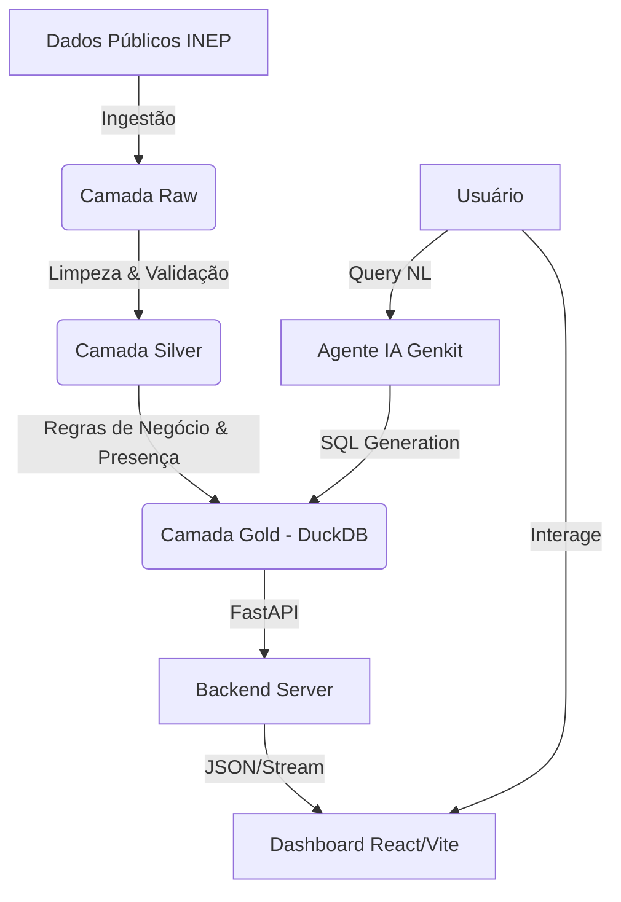

# 🤖 ENEM Data Robotics V2


> **Uma plataforma avançada de Engenharia de Dados e Inteligência Artificial para análise profunda do Exame Nacional do Ensino Médio (ENEM).**

O **ENEM Data Robotics V2** é uma solução "End-to-End" corporativa que combina pipelines de dados robustos, armazenamento OLAP de alta performance e um dashboard interativo moderno. O projeto visa democratizar o acesso a insights educacionais, focando em desigualdades socioeconômicas, raciais e regionais com rigor estatístico.

---

## ✨ Destaques da Versão Atual

### 🎯 Rigor Estatístico e Qualidade de Dados
- **Correção de Viés de Presença:** O pipeline ETL distingue estritamente entre **Total de Inscritos** (intenção) e **Provas Aplicadas** (comparecimento efetivo). Notas de alunos ausentes são tratadas adequadamente para garantir indicadores fiéis à realidade.
- **Cálculo Dinâmico de Provas:** Os indicadores de desempenho consideram dinamicamente o número de provas realizadas por cada grupo demográfico, garantindo precisão mesmo em casos de dados parciais.
- **Materialização Inteligente:** O backend SQL implementa lógica de *start-up* inteligente, evitando reprocessamentos desnecessários e garantindo persistência segura dos dados.

### 🛡️ API e Estabilidade Profissional
- **Rastreabilidade Total:** Implementação de **Request ID Middleware** que adiciona identificadores únicos (`X-Request-ID`) a todas as requisições, permitindo rastreamento preciso de logs e erros.
- **Tratamento Global de Erros:** Handler de exceções centralizado que garante que todos os erros, mesmo os inesperados (500), retornem respostas JSON estruturadas e seguras, prevenindo vazamento de stack traces.
- **Observabilidade:** Logs estruturados (JSON em produção) e instrumentação preparada para Prometheus.

### 📑 Relatórios Premium (Enterprise-Grade)
- **PDFs Vetoriais Profissionais:** Motor de geração de PDF (WeasyPrint) com CSS defensivo, garantindo layout impecável, paginação correta e cabeçalhos repetidos em documentos multipáginas.
- **Excel Formatado:** Exportação de planilhas com formatação condicional, filtros e tipos de dados corretos (números como números, texto como texto) usando `xlsxwriter`.
- **Sanitização Defensiva:** Camada de segurança que remove caracteres de controle e formata dados numéricos antes da geração de documentos, evitando corrupção de arquivos.

### 🗺️ Inteligência Geográfica e Demográfica
- **Evolução Histórica por Raça/Cor:** Gráficos avançados que permitem a análise temporal do desempenho educacional segmentado por autodeclaração racial em cada município brasileiro.
- **Tooltips Contextuais Inteligentes:** Visualizações de dados aprimoradas que exibem médias, contagens de participantes e número de provas contabilizadas ao interagir com os gráficos.
- **Mapa de Calor Unificado:** Visualização matricial dinâmica que se ajusta automaticamente aos filtros, permitindo visões macro e micro.

---

## 🚀 Funcionalidades Principais

### 📊 Dashboard Interativo (Frontend)
- **Visualizações Avançadas:** Gráficos interativos com **amCharts 5** e **Recharts**.
- **Análise Comparativa:** Radar charts para comparar desempenho de estados vs. média nacional e melhores benchmarks.
- **Evolução Histórica:** Acompanhamento temporal de notas (2009-2024) com detalhamento por disciplinas.
- **Recortes Socioeconômicos:** Análise detalhada de desempenho por raça, renda e localização geográfica.
- **Relatórios Profissionais:** Exportação de dados filtrados em Excel, PDF e CSV.
- **Assistente IA:** Chat integrado para perguntas sobre os dados (Powered by Genkit).

### 🛠️ Engenharia de Dados (Backend)
- **Arquitetura Medalhão:**
  - 🟤 **Raw:** Dados brutos do INEP.
  - ⚪ **Silver:** Dados limpos, tipados e padronizados (Parquet).
  - 🟡 **Gold:** Agregações analíticas prontas para consumo (DuckDB + Parquet).
- **DuckDB:** Banco de dados analítico embarcado para processamento massivo local.
- **FastAPI:** API RESTful de alta performance e documentação automática (Swagger UI).
- **Agentes de IA:** Orquestração inteligente de pipelines e análise de dados.

---

## 🏗️ Arquitetura do Projeto

O projeto segue uma estrutura modular e escalável:



---

## 📦 Stack Tecnológica

### Backend & Data
*   **Linguagem:** Python 3.12+
*   **Gerenciamento de Dependências:** Poetry
*   **API:** FastAPI + Pydantic
*   **Banco de Dados:** DuckDB (Processamento OLAP local)
*   **Reporting Engine:** WeasyPrint (PDF), XlsxWriter (Excel)
*   **Orquestração/IA:** Google Genkit
*   **Qualidade de Dados:** Soda Core (Validadores customizados)

### Frontend (Dashboard)
*   **Framework:** React 18 + Vite
*   **Linguagem:** TypeScript
*   **Estilização:** Tailwind CSS + Shadcn/UI
*   **Visualização de Dados:**
    *   `amcharts5`: Gráficos complexos e mapas.
    *   `recharts`: Gráficos estatísticos padrão.
    *   `lucide-react`: Ícones.

---

## ⚙️ Instalação e Execução (Docker)

A maneira recomendada de executar o projeto é via Docker Compose, garantindo que todas as dependências de sistema (incluindo as necessárias para geração de PDF) estejam corretas.

### Pré-requisitos
*   Docker Engine e Docker Compose instalados.

### Passos

1.  **Clone o repositório:**
    ```bash
    git clone https://github.com/seu-usuario/projeto-enem-data-robotics-v2.git
    cd projeto-enem-data-robotics-v2
    ```

2.  **Execute com Docker Compose:**
    ```bash
    docker compose up --build
    ```
    Isso iniciará a API (Backend) e o Dashboard (Frontend).

3.  **Acesse:**
    *   **Dashboard:** [http://localhost:5173](http://localhost:5173)
    *   **Documentação da API:** [http://localhost:8000/docs](http://localhost:8000/docs)

### Configuração de Dados
O projeto utiliza um volume local `./data` mapeado para o container. Certifique-se de que seus dados brutos ou processados estejam na pasta `data/` local para persistência.

---

## 📂 Estrutura de Diretórios

```plaintext
Projeto_Enem_Data_Robotics_V2/
├── config/                 # Configurações de hardware e ambiente
├── dashboard/              # Aplicação Frontend (React/Vite)
│   ├── src/
│   │   ├── api/            # Clientes HTTP (Axios)
│   │   ├── components/     # Componentes UI (Charts, Maps, PremiumReport)
│   │   ├── pages/          # Rotas da aplicação
│   │   └── ...
├── data/                   # Lakehouse Local (Mapeado no Docker)
│   ├── 00_raw/             # Dados brutos
│   ├── 01_silver/          # Dados limpos (Parquet)
│   └── 02_gold/            # Dados agregados (Parquet)
├── Enem_documentos_e_orquestração/ # Documentação Arquitetural e Agêntica
├── src/                    # Código Fonte Backend
│   └── enem_project/
│       ├── api/            # Rotas FastAPI e Lógica de Endpoints
│       ├── data/           # Pipelines ETL (Raw->Silver->Gold)
│       ├── infra/          # Conexão DB, Logging, IO
│       ├── services/       # Serviços de Domínio (ReportService, etc.)
│       └── orchestrator/   # Agentes e Workflows
├── tests/                  # Testes unitários e de integração
├── .genkit/                # Configuração do Genkit (IA)
├── Dockerfile              # Definição da imagem da API
├── docker-compose.yml      # Orquestração dos serviços
├── GEMINI.md               # Regras e Contexto do Assistente
└── README.md               # Documentação do Projeto
```

---

## 🧪 Testes e Qualidade

Para garantir a integridade dos dados e do código (executando localmente):

```bash
# Instalar dependências de desenvolvimento
poetry install

# Executar testes unitários (Backend)
poetry run pytest tests/

# Executar linter
poetry run ruff check .
```

---

## 🤝 Contribuição

Contribuições são bem-vindas! Sinta-se à vontade para abrir **Issues** para reportar bugs ou **Pull Requests** para melhorias.

1.  Faça um Fork do projeto
2.  Crie sua Feature Branch (`git checkout -b feature/MinhaFeature`)
3.  Commit suas mudanças (`git commit -m 'Add: Minha nova feature'`)
4.  Push para a Branch (`git push origin feature/MinhaFeature`)
5.  Abra um Pull Request

---

## 📄 Licença

Este projeto está licenciado sob a Licença MIT - veja o arquivo [LICENSE](LICENSE) para mais detalhes.

---

<div align="center">
  <sub>Desenvolvido com 🧠 e ☕ por Douglas</sub>
</div>