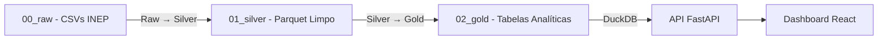

# 🤖 ENEM Data Robotics V2


> **Uma plataforma avançada de Engenharia de Dados e Inteligência Artificial para análise profunda do Exame Nacional do Ensino Médio (ENEM).**

O **ENEM Data Robotics V2** é uma solução "End-to-End" corporativa que combina pipelines de dados robustos, armazenamento OLAP de alta performance e um dashboard interativo moderno. O projeto visa democratizar o acesso a insights educacionais, focando em desigualdades socioeconômicas, raciais e regionais com rigor estatístico.

---

## 📋 Pré-requisitos

### Requisitos de Sistema

| Recurso | Mínimo | Recomendado |
|---------|--------|-------------|
| **RAM** | 8 GB | 16 GB |
| **Disco** | 100 GB livres | 150 GB livres |
| **CPU** | 4 cores | 8+ cores |

> ⚠️ **Nota:** Os microdados do ENEM ocupam aproximadamente **70 GB** para a série histórica completa (1998-2024).

### Software

- **Python 3.12+** com [Poetry](https://python-poetry.org/docs/#installation)
- **Node.js 20+** com npm (para o Dashboard)
- **Docker** e **Docker Compose** (opcional, mas recomendado)

---

## 📥 Obtenção dos Dados do INEP

Os microdados do ENEM são públicos e disponibilizados pelo INEP. **Este repositório NÃO inclui os dados** devido ao tamanho.

### 1. Download dos Microdados

Acesse o portal oficial do INEP:
- **🔗 [Microdados ENEM - INEP](https://www.gov.br/inep/pt-br/acesso-a-informacao/dados-abertos/microdados/enem)**

Faça download dos arquivos `.zip` dos anos desejados.

### 2. Estrutura de Diretórios Esperada

Após extrair os arquivos, organize-os na pasta `data/00_raw/`:

```plaintext
data/
└── 00_raw/
    ├── microdados_enem_2020/
    │   └── DADOS/
    │       └── MICRODADOS_ENEM_2020.csv
    ├── microdados_enem_2021/
    │   └── DADOS/
    │       └── MICRODADOS_ENEM_2021.csv
    ├── microdados_enem_2022/
    │   └── DADOS/
    │       └── MICRODADOS_ENEM_2022.csv
    ├── microdados_enem_2023/
    │   └── DADOS/
    │       └── MICRODADOS_ENEM_2023.csv
    └── microdados_enem_2024/
        └── DADOS/
            └── MICRODADOS_ENEM_2024.csv
```

> **Dica:** Comece com 1-2 anos recentes (2023-2024) para testes. Cada ano ocupa ~3-5 GB.

---

## 🚀 Instalação e Execução

### Opção A: Docker (Recomendado)

A maneira mais simples de executar o projeto, garantindo todas as dependências corretas.

```bash
# 1. Clone o repositório
git clone https://github.com/Douglas0101/Projeto_Enem_Data_Robotics_V2.git
cd Projeto_Enem_Data_Robotics_V2

# 2. Crie a estrutura de dados e adicione os microdados do INEP
mkdir -p data/00_raw

# 3. Execute com Docker Compose
docker compose up --build
```

**Acesse:**
- 📊 **Dashboard:** http://localhost:5173
- 📖 **API Docs:** http://localhost:8000/docs

### Opção B: Execução Local (Desenvolvimento)

#### Backend (Python)

```bash
# 1. Clone o repositório
git clone https://github.com/Douglas0101/Projeto_Enem_Data_Robotics_V2.git
cd Projeto_Enem_Data_Robotics_V2

# 2. Instale as dependências Python
poetry install

# 3. Execute o pipeline ETL (Raw → Silver → Gold)
poetry run enem --dashboard --anos 2023-2024

# 4. Inicie o servidor da API
poetry run enem serve
# Ou diretamente:
poetry run uvicorn enem_project.api.main:app --reload --port 8000
```

#### Frontend (React)

```bash
# Em outro terminal:
cd dashboard
npm install
npm run dev
```

**Acesse:**
- 📊 **Dashboard:** http://localhost:5173
- 📖 **API Docs:** http://localhost:8000/docs

---

## ⚙️ Pipeline de Dados (ETL)

O projeto utiliza a **Arquitetura Medallion** (Lakehouse):



### Comandos CLI

| Comando | Descrição |
|---------|-----------|
| `poetry run enem --ano 2023` | Processa Raw → Silver para um ano específico |
| `poetry run enem --anos 2020-2024` | Processa múltiplos anos |
| `poetry run enem --dashboard` | Gera tabelas Gold (analíticas) para o Dashboard |
| `poetry run enem --dashboard --skip-existing` | Pula anos já processados |
| `poetry run enem serve` | Inicia o servidor FastAPI |

### Exemplo: Pipeline Completo

```bash
# Processa anos 2020-2024 e gera tabelas do dashboard
poetry run enem --dashboard --anos 2020-2024

# Se adicionar novos anos posteriormente:
poetry run enem --dashboard --anos 2025 --skip-existing
```

---

## 🔧 Variáveis de Ambiente

| Variável | Descrição | Padrão |
|----------|-----------|--------|
| `ENEM_DATA_DIR` | Diretório raiz dos dados | `./data` |
| `ENEM_FORCE_MATERIALIZE` | Força recriação das tabelas DuckDB | `false` |
| `DUCKDB_MEMORY_LIMIT` | Limite de memória do DuckDB | `4GB` |
| `DUCKDB_THREADS` | Threads para processamento paralelo | `2` |
| `GEMINI_API_KEY` | Chave da API Google Gemini (IA) | - |

Crie um arquivo `.env` na raiz do projeto:

```bash
ENEM_DATA_DIR=/app/data
DUCKDB_MEMORY_LIMIT=8GB
DUCKDB_THREADS=4
GEMINI_API_KEY=sua_chave_aqui
```

---

## 📦 Stack Tecnológica

### Backend & Data
- **Python 3.12+** / Poetry
- **FastAPI** + Pydantic v2
- **DuckDB** (OLAP embarcado)
- **Pandas** / PyArrow
- **WeasyPrint** (PDFs) / XlsxWriter (Excel)

### Frontend (Dashboard)
- **React 18** + Vite
- **TypeScript**
- **Tailwind CSS** + Radix UI
- **amCharts 5** / Recharts / D3.js

---

## 📂 Estrutura de Diretórios

```plaintext
Projeto_Enem_Data_Robotics_V2/
├── dashboard/              # Frontend React/Vite
│   ├── src/
│   │   ├── api/            # Clientes HTTP
│   │   ├── components/     # UI Components + Charts
│   │   └── pages/          # Rotas da aplicação
├── data/                   # Lakehouse Local (NÃO COMMITADO)
│   ├── 00_raw/             # Microdados originais INEP
│   ├── 01_silver/          # Dados limpos (Parquet)
│   └── 02_gold/            # Tabelas analíticas (Parquet/DuckDB)
├── src/enem_project/       # Backend Python
│   ├── api/                # Rotas FastAPI
│   ├── config/             # Settings, Paths
│   ├── data/               # Pipelines ETL
│   ├── infra/              # DB, IO, Logging, Security
│   └── services/           # Lógica de Negócio
├── tests/                  # Testes unitários e integração
├── Dockerfile              # Build da API
├── docker-compose.yml      # Orquestração
└── pyproject.toml          # Dependências Python
```

---

## ❗ Troubleshooting

### Erro de Memória ao Processar Anos Grandes

```bash
# Ajuste o limite de memória do DuckDB
export DUCKDB_MEMORY_LIMIT=2GB

# Ou processe anos individualmente
poetry run enem --ano 2023
poetry run enem --ano 2024
poetry run enem --dashboard
```

### Erro: DuckDB Database Locked

O DuckDB permite apenas **uma conexão de escrita** por vez.

```bash
# Certifique-se de que o servidor da API não está rodando
# ao executar pipelines ETL
pkill -f uvicorn
poetry run enem --dashboard
```

### Erro: WeasyPrint / Geração de PDF

Instale as dependências de sistema:

```bash
# Ubuntu/Debian
sudo apt-get install libpango-1.0-0 libpangoft2-1.0-0 libcairo2 libpangocairo-1.0-0

# macOS
brew install pango cairo
```

### Docker: Network Not Found ao Reiniciar

```bash
docker compose down --remove-orphans
docker compose up --build
```

---

## 🧪 Testes

```bash
# Testes unitários (Backend)
poetry run pytest tests/ -v

# Linting
poetry run ruff check .

# Testes de segurança
poetry run pytest tests/test_security_engineering.py -v

# Testes E2E (Frontend)
cd dashboard
npx playwright test
```

---

## 📚 Documentação Técnica

| Documento | Descrição |
|-----------|-----------|
| [Checklist de Produção](Enem_documentos_e_orquestração/checklist_producao_segura_escalavel.md) | 94 itens de segurança e escalabilidade |
| [Plano de Cibersegurança](Enem_documentos_e_orquestração/Ciberseguranca-e-Escalabilidade.md) | Zero Trust, IAM, proteção de dados |
| [Arquitetura do Projeto](Enem_documentos_e_orquestração/arquitetura_projeto_enem_data_robotics.md) | Estrutura completa e orquestração |
| [GEMINI.md](GEMINI.md) | Regras e contexto do assistente de IA |

---

## ✨ Destaques da Versão Atual

- **Correção de Viés de Presença:** Distingue inscritos vs. participantes efetivos
- **Rastreabilidade Total:** Request ID em todas as requisições
- **PDFs Profissionais:** WeasyPrint com layout paginado
- **Zero Trust:** Autenticação JWT + Argon2id + RBAC
- **Rate Limiting:** Proteção contra DDoS
- **Data Masking (LGPD):** Proteção de dados PII

---

## 🤝 Contribuição

1. Faça um Fork do projeto
2. Crie sua Feature Branch (`git checkout -b feature/MinhaFeature`)
3. Commit suas mudanças (`git commit -m 'Add: Minha nova feature'`)
4. Push para a Branch (`git push origin feature/MinhaFeature`)
5. Abra um Pull Request

---

## 📄 Licença

Este projeto está licenciado sob a Licença MIT - veja o arquivo [LICENSE](LICENSE) para mais detalhes.

---

<div align="center">
  <sub>Desenvolvido com 🧠 e ☕ por Douglas</sub>
</div>