# 🤖 ENEM Data Robotics V2


> **Uma plataforma avançada de Engenharia de Dados e Inteligência Artificial para análise profunda do Exame Nacional do Ensino Médio (ENEM).**

O **ENEM Data Robotics V2** é uma solução "End-to-End" que combina pipelines de dados robustos, armazenamento OLAP de alta performance e um dashboard interativo moderno. O projeto visa democratizar o acesso a insights educacionais, focando em desigualdades socioeconômicas, raciais e regionais.

---

## 🚀 Funcionalidades Principais

### 📊 Dashboard Interativo (Frontend)
- **Visualizações Avançadas:** Gráficos interativos com **amCharts 5** e **Recharts**.
- **Análise Comparativa:** Radar charts para comparar desempenho de estados vs. média nacional.
- **Evolução Histórica:** Acompanhamento temporal de notas (2009-2024) com eixos empilhados independentes.
- **Georreferenciamento:** Mapas de calor e clusters de desempenho por município.
- **Assistente IA:** Chat integrado para perguntas sobre os dados (Powered by Genkit).

### 🛠️ Engenharia de Dados (Backend)
- **Arquitetura Medalhão:**
  - 🟤 **Raw:** Dados brutos do INEP.
  - ⚪ **Silver:** Dados limpos, tipados e padronizados.
  - 🟡 **Gold:** Agregações analíticas prontas para consumo (OLAP).
- **DuckDB:** Banco de dados analítico embarcado para processamento massivo local.
- **FastAPI:** API RESTful de alta performance e documentação automática (Swagger UI).
- **Agentes de IA:** Orquestração inteligente de pipelines e análise de dados.

---

## 🏗️ Arquitetura do Projeto

O projeto segue uma estrutura modular e escalável:

```mermaid
graph TD
    A[Dados Públicos INEP] -->|Ingestão| B(Camada Raw)
    B -->|Limpeza & Validação| C(Camada Silver)
    C -->|Agregação & Regras de Negócio| D(Camada Gold - DuckDB)
    D -->|FastAPI| E[Backend Server]
    E -->|JSON| F[Dashboard React/Vite]
    G[Usuário] -->|Interage| F
    G -->|Query NL| H[Agente IA Genkit]
    H -->|SQL Generation| D
```



---

## 📦 Stack Tecnológica

### Backend & Data
*   **Linguagem:** Python 3.12+
*   **Gerenciamento de Dependências:** Poetry
*   **API:** FastAPI + Pydantic
*   **Banco de Dados:** DuckDB (Processamento OLAP local)
*   **Orquestração/IA:** Google Genkit
*   **Qualidade de Dados:** Soda Core (Validadores customizados)

### Frontend (Dashboard)
*   **Framework:** React 18 + Vite
*   **Linguagem:** TypeScript
*   **Estilização:** Tailwind CSS + Shadcn/UI
*   **Visualização de Dados:**
    *   `amcharts5`: Gráficos complexos e mapas.
    *   `recharts`: Gráficos estatísticos padrão.
    *   `lucide-react`: Ícones.

---

## ⚙️ Instalação e Configuração

Siga os passos abaixo para executar o ambiente de desenvolvimento.

### Pré-requisitos
*   Python 3.12 ou superior
*   Node.js 18 ou superior
*   Poetry (Gerenciador de pacotes Python)

### 1. Backend (API e Processamento)

```bash
# Clone o repositório
git clone https://github.com/seu-usuario/projeto-enem-data-robotics-v2.git
cd projeto-enem-data-robotics-v2

# Instale as dependências com Poetry
poetry install

# Ative o ambiente virtual
poetry shell

# Execute a API
poetry run uvicorn src.enem_project.api.main:app --reload
```
*A API estará disponível em: `http://localhost:8000/docs`*

### 2. Frontend (Dashboard)

```bash
# Navegue até a pasta do dashboard
cd dashboard

# Instale as dependências
npm install

# Inicie o servidor de desenvolvimento
npm run dev
```
*O Dashboard estará disponível em: `http://localhost:5173`*

---

## 📂 Estrutura de Diretórios

```plaintext
Projeto_Enem_Data_Robotics_V2/
├── config/                 # Configurações de hardware e ambiente
├── dashboard/              # Aplicação Frontend (React/Vite)
│   ├── src/
│   │   ├── api/            # Clientes HTTP
│   │   ├── components/     # Componentes UI (Charts, Maps, Cards)
│   │   ├── pages/          # Rotas da aplicação
│   │   └── ...
├── data/                   # Lakehouse Local (Ignorado no Git)
│   ├── 00_raw/
│   ├── 01_silver/
│   └── 02_gold/
├── src/                    # Código Fonte Backend
│   └── enem_project/
│       ├── api/            # Rotas FastAPI
│       ├── data/           # Pipelines ETL (Raw->Silver->Gold)
│       ├── infra/          # Conexão DB, Logging, IO
│       └── orchestrator/   # Agentes e Workflows
├── tests/                  # Testes unitários e de integração
└── ...
```

---

## 🧪 Testes e Qualidade

Para garantir a integridade dos dados e do código:

```bash
# Executar testes unitários (Backend)
pytest tests/

# Executar linter
ruff check .
```

---

## 🤝 Contribuição

Contribuições são bem-vindas! Sinta-se à vontade para abrir **Issues** para reportar bugs ou **Pull Requests** para melhorias.

1.  Faça um Fork do projeto
2.  Crie sua Feature Branch (`git checkout -b feature/MinhaFeature`)
3.  Commit suas mudanças (`git commit -m 'Add: Minha nova feature'`)
4.  Push para a Branch (`git push origin feature/MinhaFeature`)
5.  Abra um Pull Request

---

## 📄 Licença

Este projeto está licenciado sob a Licença MIT - veja o arquivo [LICENSE](LICENSE) para mais detalhes.

---

<div align="center">
  <sub>Desenvolvido com 🧠 e ☕ por Douglas</sub>
</div>